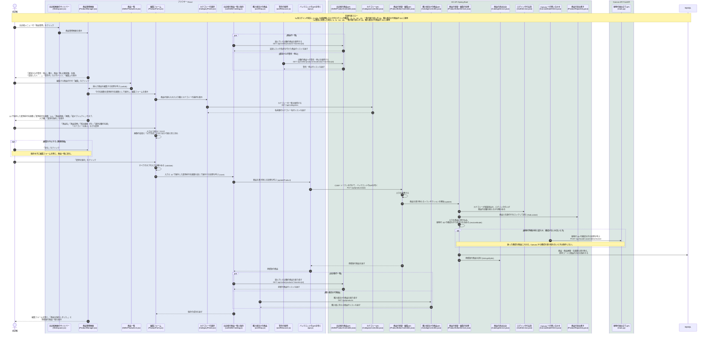

# EC-S04 商品情報を編集する

```mermaid
sequenceDiagram
    autonumber
    actor User as 出店者
    box rgba(47,111,219,0.10) ブラウザー React
        participant Work as 出店者画面のサイドバー<br/>(Workspace.jsx)
        participant Mgr as 商品管理画面<br/>(ProductManager.jsx)
        participant List as 商品一覧<br/>(SellerProductList.jsx)
        participant Form as 編集フォーム<br/>(ProductForm.jsx)
        participant Picker as カテゴリーの選択<br/>(CategoryPicker.jsx)
        participant Cat as 出店者の商品一覧と保存<br/>(useSellerCatalog.js)
        participant Shop as 購入者向けの商品<br/>(useShop.js)
        participant Hook as 警告の取得<br/>(useResource.js)
        participant Http as バックエンドのAPIを叩く<br/>(api.js)
    end
    box rgba(27,127,92,0.12) EC API Spring Boot
        participant SPC as 出店者の商品API<br/>(SellerProductController.java)
        participant CatCtrl as カテゴリーAPI<br/>(CategoryController.java)
        participant EdCtrl as 商品の登録・編集API<br/>(ProductEditorController.java)
        participant CatalogCtrl as 購入者向けの商品API<br/>(CatalogController.java)
        participant EdSvc as 商品の登録・編集の処理<br/>(ProductEditorService.java)
        participant CatalogSvc as 商品の読み込み<br/>(CatalogService.java)
        participant Auth as ログイン中の会員<br/>(AuthService.java)
        participant CModel as Canvas への問い合わせ<br/>(CanvasModelClient.java)
        participant ProdRepo as 商品の読み書き<br/>(ProductRepository.java)
    end
    box rgba(27,127,92,0.12) Canvas API FastAPI
        participant CApi as 植物の組み立てAPI<br/>(main.py)
    end
    participant Db as MySQL

    Note over User,Db: 共通代替フロー<br/>*b 未ログインの場合: 2 (URL を直接開いたときのログインの確認)、3、5、12、22、一覧の取り直しの 33、購入者向けの商品の 35 に適用<br/>*a 通信に失敗した場合: 3、5、12、22、一覧の取り直しの 33、購入者向けの商品の 35 に適用

    User->>Work: 出店者メニューの「商品管理」をクリック
    Work->>Mgr: 商品管理画面を表示
    par 商品の一覧
        Cat->>SPC: 選んでいる店舗の商品を取得する<br/>GET /api/seller/products?storeId={id}
        SPC-->>Cat: 追加した人の名前を付けた商品のリストを返す
    and 運営からの警告・停止
        Hook->>SPC: 店舗の商品への警告・停止を取得する<br/>GET /api/seller/products/moderation?storeId={id}
        SPC-->>Hook: 警告・停止のリストを返す
    end
    Mgr-->>User: 「運営からの警告・停止」欄と、商品一覧 (公開状態、在庫、<br/>「追加した人：…」、「警告中」などのバッジ、「編集」) を表示

    User->>List: 編集する商品の行の「編集」をクリック
    List->>Mgr: 選んだ商品を編集する処理を呼ぶ (onEdit)
    Mgr->>Form: 今の在庫数を変更前の在庫数として保持し、編集フォームを表示
    Form->>Picker: 商品の値を入れた入力欄とカテゴリーの選択を表示
    Picker->>CatCtrl: カテゴリーの一覧を取得する<br/>GET /api/categories
    CatCtrl-->>Picker: 名前順のカテゴリー名のリストを返す
    Mgr-->>User: 10 で保持した変更前の在庫数 (「変更前の在庫数：N」)、「商品情報」「画像」「庭オブジェクト」のタブ、<br/>入力欄、「変更を保存」を表示

    User->>Form: 「商品名」「商品説明」「税込価格（円）」「選択店舗の在庫」<br/>「カテゴリーを選ぶ」などを変更
    Form->>Form: 入力を下書きに入れる<br/>画像の追加と「AIで生成」は EC-S03 の図と同じ流れ
    opt 編集を中止する (関連情報)
        User->>Mgr: 「戻る」をクリック
        Note over User,Mgr: 保存せずに編集フォームを閉じ、商品一覧に戻る。
    end

    User->>Form: 「変更を保存」をクリック
    Form->>Form: すべてのタブの入力を確かめる (validate)
    Form->>Cat: 入力と 10 で保持した変更前の在庫数を渡して保存する処理を呼ぶ (save)
    Cat->>Http: 商品を書き換える処理を呼ぶ (updateProduct)
    Http->>EdCtrl: CSRF トークンを付けて、バックエンドのAPIを叩く<br/>PUT /api/products/{id}
    EdCtrl->>EdCtrl: 入力を検査する
    EdCtrl->>EdSvc: 商品を書き換えるトランザクションを開始 (update)
    EdSvc->>Auth: カテゴリーが登録済みか、ログイン中の人が<br/>商品の店舗を扱えるかを確かめる
    EdSvc->>ProdRepo: 商品と在庫の行をロックして読む (findLocked)
    EdSvc->>EdSvc: 入力を商品に書き込み、<br/>植物の 3D の構成を作り直すかを決める (resolveModel)
    opt 植物の特徴が前と違うか、構成がないか古いとき
        CModel->>CApi: 植物の 3D の構成を作る処理を呼ぶ<br/>POST /api/model-assemblies/resolve
        Note over EdSvc,CApi: 返った構成を商品に入れる。Canvas から構成を受け取れないときは保存しない。
    end
    EdSvc->>Db: 商品・商品画像・在庫数を書き換え、<br/>素材コードと商品の対応を保存する
    EdSvc->>CatalogSvc: 更新後の商品を読む (listingsByIds)
    EdCtrl-->>Http: 更新後の商品を返す
    Http-->>Cat: 更新後の商品
    par 出店者の一覧
        Cat->>SPC: 選んでいる店舗の商品を取り直す<br/>GET /api/seller/products?storeId={id}
        SPC-->>Cat: 最新の商品のリストを返す
    and 購入者向けの商品
        Shop->>CatalogCtrl: 購入者向けの商品を取り直す<br/>GET /api/products
        CatalogCtrl-->>Shop: 購入者に見える商品のリストを返す
    end
    Cat-->>Form: 保存の成功を返す
    Mgr-->>User: 編集フォームを閉じ、「商品を保存しました。」と<br/>更新後の商品一覧を表示
```

