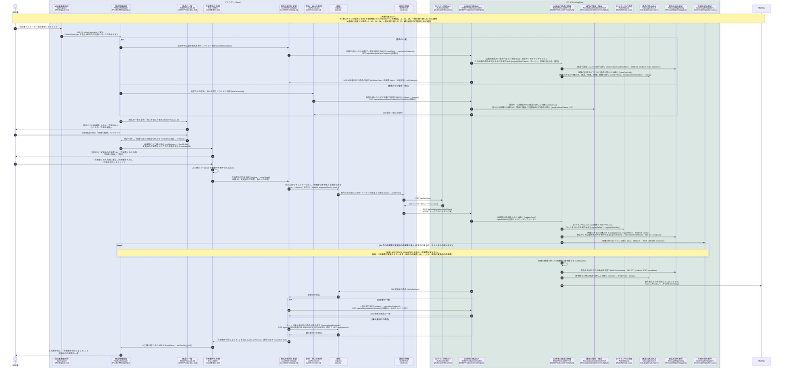

# EC-S05 店舗在庫数を更新する

```mermaid
sequenceDiagram
    autonumber
    actor User as 出店者
    box rgba(47,111,219,0.10) ブラウザー React
        participant Work as 出店者画面の枠<br/>Workspace<br/>(Workspace.jsx)
        participant Mgr as 商品管理画面<br/>ProductManager<br/>(ProductManager.jsx)
        participant List as 商品の一覧<br/>SellerProductList<br/>(SellerProductList.jsx)
        participant Editor as 在庫数の入力欄<br/>StockEditor<br/>(StockEditor.jsx)
        participant Cat as 商品の取得と変更<br/>useSellerCatalog<br/>(useSellerCatalog.js)
        participant Hook as 警告・停止の取得<br/>useResource<br/>(useResource.js)
        participant Http as 通信<br/>request<br/>(api.js)
        participant AuthJs as 通信の準備<br/>authFetch<br/>(auth.js)
    end
    box rgba(27,127,92,0.12) EC API Spring Boot
        participant AuthCtrl as ログイン状態API<br/>AuthController<br/>(AuthController.java)
        participant Ctrl as 出店者の商品API<br/>SellerProductController<br/>(SellerProductController.java)
        participant Svc as 出店者の商品の処理<br/>SellerProductService<br/>(SellerProductService.java)
        participant Mod as 運営の警告・停止<br/>ProductModerationService<br/>(ProductModerationService.java)
        participant Auth as ログイン中の会員<br/>AuthService<br/>(AuthService.java)
        participant CatSvc as 商品の読み込み<br/>CatalogService<br/>(CatalogService.java)
        participant Prod as 商品の読み書き<br/>ProductRepository<br/>(ProductRepository.java)
        participant Inv as 在庫の読み書き<br/>InventoryRepository<br/>(InventoryRepository.java)
    end
    participant Db as MySQL

    Note over User,Db: 共通代替フロー<br/>*b 未ログインの場合: 2 (URL を直接開いたときのログインの確認)、4、10、26、一覧の取り直しの 37 に適用<br/>*a 通信に失敗した場合: 4、10、24、26、一覧の取り直しの 37、購入者向けの商品の 39 に適用

    User->>Work: 出店者メニューの「商品管理」をクリック
    Work->>Mgr: URL を /seller/products に変え、<br/>ProductManager を表示 (選択中の店舗にロールがあるとき)
    par 商品の一覧
        Mgr->>Cat: 選択中の店舗の商品を取りに行くよう頼む (useSellerCatalog)
        Cat->>Ctrl: 店舗が決まったら自動で一覧の通信を始める (useEffect → api.sellerProducts)<br/>GET /api/seller/products?storeId={店舗ID}
        Ctrl->>Svc: 店舗の商品の一覧を作るよう頼む (list)。読むだけのトランザクション<br/>この店舗の商品を見られるかを確かめる (requireStoreViewer。オーナー、所属の担当者、運営)
        Svc->>Prod: 商品を追加した人の名前を読む (findCreatorNamesAtStore、SELECT products JOIN members)
        Svc->>CatSvc: 店舗の削除されていない商品を読むよう頼む (storeProducts)<br/>店舗があるかを確かめ、商品、在庫、店舗、組織を読む (requireStore、findNotDeletedAtStore、listings)
        Ctrl-->>Cat: 200 出店者向けの商品の配列 (toSellerView。在庫数 stock、公開状態。setProducts)
    and 運営からの警告・停止
        Mgr->>Hook: 運営からの警告・停止を取りに行くよう頼む (useResource)
        Hook->>Ctrl: 画面を開いたときに自動で通信を始める (reload → request)<br/>GET /api/seller/products/moderation?storeId={店舗ID}
        Ctrl->>Mod: 警告中・公開停止中の商品を読むよう頼む (noticesAt)<br/>見られる店舗かを確かめ、警告の履歴と公開停止中の商品を読む (requireStoreViewer ほか)
        Ctrl-->>Hook: 200 警告・停止の配列
    end
    Mgr->>List: 商品の一覧と警告・停止を渡して表示 (SellerProductList)
    List-->>User: 商品ごとの在庫数、0 なら「在庫切れ」、<br/>行ごとの「在庫を編集」

    User->>List: 対象商品の行の「在庫を編集」をクリック
    List->>Mgr: 選択を外し、在庫を変える商品を伝える (setSelected([]) → onStock)
    Mgr->>Editor: 在庫数の入力欄を表示 (setStocking → StockEditor)<br/>変更前の在庫数として今の在庫数を覚える (expected)
    Editor-->>User: 「(商品名)：変更前の在庫数 N」、「在庫数」の入力欄、<br/>「在庫を保存」、「取消」
    User->>Editor: 「在庫数」の入力欄に新しい在庫数を入力し、<br/>「在庫を保存」をクリック
    Editor->>Editor: 入力値が 0〜10000 の整数かを確かめる (save)
    Editor->>Cat: 在庫数の保存を頼む (onSave → saveStock)<br/>店舗 ID、変更前の在庫数、新しい在庫数
    Cat->>Http: 前のお知らせとエラーを消し、在庫数を書き換える通信を送る<br/>(write → request、本文は { storeId, expectedStock, stock })
    Http->>AuthJs: 書き込みの前に CSRF トークンを取るよう頼む (send → authFetch)
    AuthJs->>AuthCtrl: GET /api/auth/csrf
    AuthCtrl-->>AuthJs: 200 ヘッダー名とトークン (csrf)
    AuthJs->>Ctrl: PUT /api/seller/products/{id}/stock<br/>(CSRF トークンのヘッダー付き)
    Ctrl->>Svc: 在庫数を書き換えるよう頼む (updateStock)<br/>updateStock 全体が 1 つのトランザクション
    Svc->>Auth: ログイン中の人がこの店舗で STAFF 以上の<br/>ロールを持つかを確かめる (requireSeller → requireStoreRole)
    Svc->>Prod: 店舗があるかを確かめ (CatalogService.requireStore、SELECT stores)、<br/>商品がこの店舗のものかを確かめる (requireAtStore → findStoreReferences、SELECT products)
    Svc->>Inv: 在庫の行をロックして読む (lock、SELECT ... FOR UPDATE inventory)
    break 8a 今の在庫数が変更前の在庫数と違う (注文の引き当て、キャンセルの戻しなど)
        Note over Inv,Mgr: 結果: 409 STOCK_CHANGED を返し、在庫数は変えない。<br/>画面: 「在庫数が変更されています（現在の在庫数：N）。…」と、最新の変更前の在庫数。
    end
    Svc->>Svc: 在庫の数量を新しい在庫数に書き換える (setQuantity)
    Svc->>Prod: 商品を追加した人の名前を読む (findCreatorName、SELECT products JOIN members)
    Svc->>CatSvc: 書き換えた後の商品を読むよう頼む (product → findByIdIn、listings)
    Svc->>Db: 書き換えた行を保存してコミットする<br/>(save は呼ばない。UPDATE inventory)
    Ctrl-->>Http: 200 更新後の商品 (toSellerView)
    Http-->>Cat: 更新後の商品
    par 出店者の一覧
        Cat->>Ctrl: 一覧を取り直す (refresh → api.sellerProducts)<br/>GET /api/seller/products?storeId={店舗ID}。流れは 4〜7 と同じ
        Ctrl-->>Cat: 200 最新の商品の一覧
    and 購入者向けの商品
        Cat->>Http: カートと購入者向けの商品を取り直す (shop.refreshProducts)<br/>GET /api/cart は出店者には 403 BUYER_REQUIRED、続けて GET /api/products
        Http-->>Cat: 購入者向けの商品
    end
    Cat-->>Editor: 「在庫数を保存しました。」を出し (shop.setNotice)、成功を返す (saved が true)
    Editor->>Mgr: 入力欄を閉じるよう伝える (onDone → setStocking(null))
    Mgr-->>User: 入力欄を閉じ、「在庫数を保存しました。」と<br/>更新後の在庫数の一覧
```

