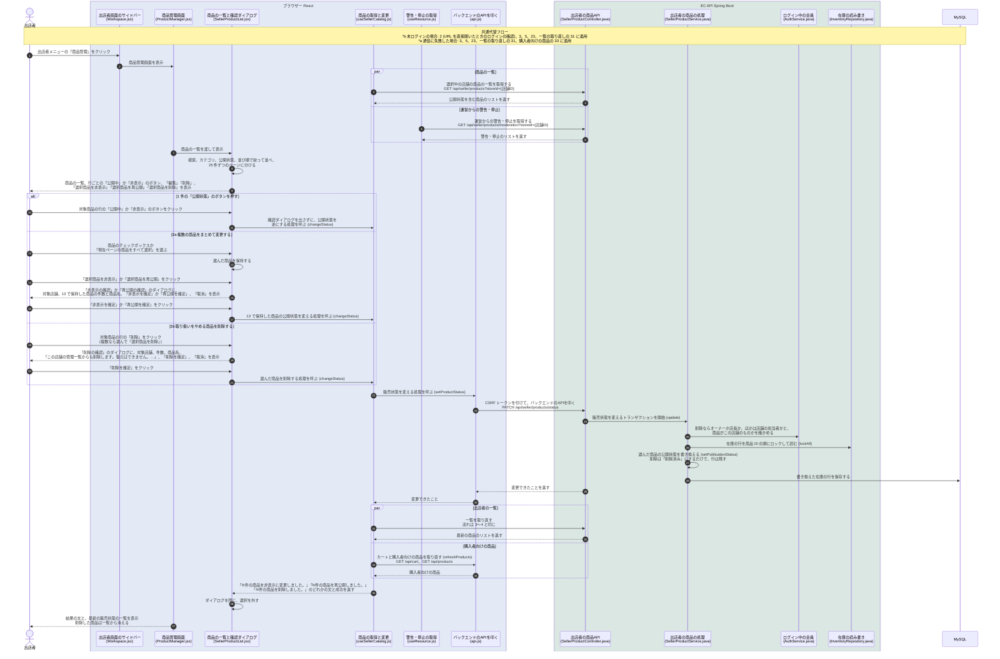

# EC-S06 商品の販売状態を変更する

```mermaid
sequenceDiagram
    autonumber
    actor User as 出店者
    box rgba(47,111,219,0.10) ブラウザー React
        participant Work as 出店者画面のサイドバー<br/>(Workspace.jsx)
        participant Mgr as 商品管理画面<br/>(ProductManager.jsx)
        participant List as 商品の一覧と確認ダイアログ<br/>(SellerProductList.jsx)
        participant Cat as 商品の取得と変更<br/>(useSellerCatalog.js)
        participant Hook as 警告・停止の取得<br/>(useResource.js)
        participant Http as バックエンドのAPIを叩く<br/>(api.js)
    end
    box rgba(27,127,92,0.12) EC API Spring Boot
        participant Ctrl as 出店者の商品API<br/>(SellerProductController.java)
        participant Svc as 出店者の商品の処理<br/>(SellerProductService.java)
        participant Auth as ログイン中の会員<br/>(AuthService.java)
        participant Inv as 在庫の読み書き<br/>(InventoryRepository.java)
    end
    participant Db as MySQL

    Note over User,Db: 共通代替フロー<br/>*b 未ログインの場合: 2 (URL を直接開いたときのログインの確認)、3、5、23、一覧の取り直しの 31 に適用<br/>*a 通信に失敗した場合: 3、5、23、一覧の取り直しの 31、購入者向けの商品の 33 に適用

    User->>Work: 出店者メニューの「商品管理」をクリック
    Work->>Mgr: 商品管理画面を表示
    par 商品の一覧
        Cat->>Ctrl: 選択中の店舗の商品の一覧を取得する<br/>GET /api/seller/products?storeId={店舗ID}
        Ctrl-->>Cat: 公開状態を含む商品のリストを返す
    and 運営からの警告・停止
        Hook->>Ctrl: 運営からの警告・停止を取得する<br/>GET /api/seller/products/moderation?storeId={店舗ID}
        Ctrl-->>Hook: 警告・停止のリストを返す
    end
    Mgr->>List: 商品の一覧を渡して表示
    List->>List: 検索、カテゴリ、公開状態、並び順で絞って並べ、<br/>25 件ずつのページに分ける
    List-->>User: 商品の一覧、行ごとの「公開中」か「非表示」のボタン、「編集」「削除」、<br/>「選択商品を非表示」「選択商品を再公開」「選択商品を削除」を表示

    alt 1 件の「公開状態」のボタンを押す
        User->>List: 対象商品の行の「公開中」か「非表示」のボタンをクリック
        List->>Cat: 確認ダイアログを出さずに、公開状態を<br/>逆にする処理を呼ぶ (changeStatus)
    else 3a 複数の商品をまとめて変更する
        User->>List: 商品のチェックボックスか<br/>「現在ページの商品をすべて選択」を選ぶ
        List->>List: 選んだ商品を保持する
        User->>List: 「選択商品を非表示」か「選択商品を再公開」をクリック
        List-->>User: 「非表示の確認」か「再公開の確認」のダイアログに、<br/>対象店舗、13 で保持した商品の件数と商品名、「非表示を確定」か「再公開を確定」、「取消」を表示
        User->>List: 「非表示を確定」か「再公開を確定」をクリック
        List->>Cat: 13 で保持した商品の公開状態を変える処理を呼ぶ (changeStatus)
    else 3b 取り扱いをやめる商品を削除する
        User->>List: 対象商品の行の「削除」をクリック<br/>(複数なら選んで「選択商品を削除」)
        List-->>User: 「削除の確認」のダイアログに、対象店舗、件数、商品名、<br/>「この店舗の管理一覧からも削除します。復元はできません。…」、「削除を確定」、「取消」を表示
        User->>List: 「削除を確定」をクリック
        List->>Cat: 選んだ商品を削除する処理を呼ぶ (changeStatus)
    end

    Cat->>Http: 販売状態を変える処理を呼ぶ (setProductStatus)
    Http->>Ctrl: CSRF トークンを付けて、バックエンドのAPIを叩く<br/>PATCH /api/seller/products/status
    Ctrl->>Svc: 販売状態を変えるトランザクションを開始 (update)
    Svc->>Auth: 削除ならオーナーか店長か、ほかは店舗の担当者かと、<br/>商品がこの店舗のものかを確かめる
    Svc->>Inv: 在庫の行を商品 ID の順にロックして読む (lockAll)
    Svc->>Svc: 選んだ商品の公開状態を書き換える (setPublicationStatus)<br/>削除は「削除済み」にするだけで、行は残す
    Svc->>Db: 書き換えた在庫の行を保存する
    Ctrl-->>Http: 変更できたことを返す
    Http-->>Cat: 変更できたこと
    par 出店者の一覧
        Cat->>Ctrl: 一覧を取り直す<br/>流れは 3〜4 と同じ
        Ctrl-->>Cat: 最新の商品のリストを返す
    and 購入者向けの商品
        Cat->>Http: カートと購入者向けの商品を取り直す (refreshProducts)<br/>GET /api/cart、GET /api/products
        Http-->>Cat: 購入者向けの商品
    end
    Cat-->>List: 「N件の商品を非表示に変更しました。」「N件の商品を再公開しました。」<br/>「N件の商品を削除しました。」のどれかの文と成功を返す
    List->>List: ダイアログを閉じ、選択を外す
    Mgr-->>User: 結果の文と、最新の販売状態の一覧を表示<br/>削除した商品は一覧から消える
```

