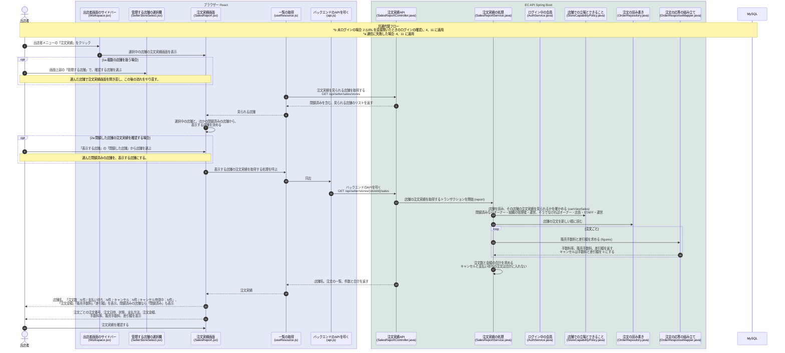

# EC-S07 注文実績を確認する

```mermaid
sequenceDiagram
    autonumber
    actor User as 出店者
    box rgba(47,111,219,0.10) ブラウザー React
        participant Work as 出店者画面のサイドバー<br/>(Workspace.jsx)
        participant Sel as 管理する店舗の選択欄<br/>(SellerStoreSelect.jsx)
        participant Page as 注文実績画面<br/>(SalesReport.jsx)
        participant Hook as 一覧の取得<br/>(useResource.js)
        participant Http as バックエンドのAPIを叩く<br/>(api.js)
    end
    box rgba(27,127,92,0.12) EC API Spring Boot
        participant Ctrl as 注文実績API<br/>(SalesReportController.java)
        participant Svc as 注文実績の処理<br/>(SalesReportService.java)
        participant Auth as ログイン中の会員<br/>(AuthService.java)
        participant Policy as 店舗での立場とできること<br/>(StoreCapabilityPolicy.java)
        participant OrderRepo as 注文の読み書き<br/>(OrderRepository.java)
        participant Mapper as 注文の応答の組み立て<br/>(OrderResponseMapper.java)
    end
    participant Db as MySQL

    Note over User,Db: 共通代替フロー<br/>*b 未ログインの場合: 2 (URL を直接開いたときのログインの確認)、4、11 に適用<br/>*a 通信に失敗した場合: 4、11 に適用

    User->>Work: 出店者メニューの「注文実績」をクリック
    Work->>Page: 選択中の店舗の注文実績画面を表示
    opt 1a 複数の店舗を扱う場合
        User->>Sel: 画面上部の「管理する店舗」で、確認する店舗を選ぶ
        Note over User,Page: 選んだ店舗で注文実績画面を開き直し、この後の流れをやり直す。
    end
    Hook->>Ctrl: 注文実績を見られる店舗を取得する<br/>GET /api/seller/sales/stores
    Ctrl-->>Hook: 閉鎖済みを含む、見られる店舗のリストを返す
    Hook-->>Page: 見られる店舗
    Page->>Page: 選択中の店舗と、ほかの閉鎖済みの店舗から、<br/>表示する店舗を決める
    opt 2a 閉鎖した店舗の注文実績を確認する場合
        User->>Page: 「表示する店舗」の「閉鎖した店舗」から店舗を選ぶ
        Note over User,Page: 選んだ閉鎖済みの店舗を、表示する店舗にする。
    end
    Page->>Hook: 表示する店舗の注文実績を取得する処理を呼ぶ
    Hook->>Http: 同左
    Http->>Ctrl: バックエンドのAPIを叩く<br/>GET /api/seller/stores/{storeId}/sales
    Ctrl->>Svc: 店舗の注文実績を取得するトランザクションを開始 (report)
    Svc->>Policy: 店舗を読み、その店舗の注文実績を見られるかを確かめる (canViewSales)<br/>閉鎖済みならオーナー・組織の管理者・運営、そうでなければオーナー・店長・STAFF・運営
    Svc->>OrderRepo: 店舗の注文を新しい順に読む
    loop 注文ごと
        Svc->>Mapper: 販売手数料と差引額を求める (figures)
        Mapper-->>Svc: 手数料率、販売手数料、差引額を返す<br/>キャンセルは手数料と差引額を 0 にする
    end
    Svc->>Svc: 注文数と金額の合計を求める<br/>キャンセルと支払い待ちの注文は合計に入れない
    Ctrl-->>Hook: 店舗名、注文の一覧、件数と合計を返す
    Hook-->>Page: 注文実績
    Page-->>User: 店舗名、「注文数：N件 / 支払い待ち：N件 / キャンセル：N件 / キャンセル申請中：N件」、<br/>「注文金額」「販売手数料」「差引額」を表示。閉鎖済みの店舗なら「閉鎖済み」も表示
    Page-->>User: 注文ごとの注文番号、注文日時、状態、支払方法、注文金額、<br/>手数料率、販売手数料、差引額を表示
    User->>Page: 注文実績を確認する
```

