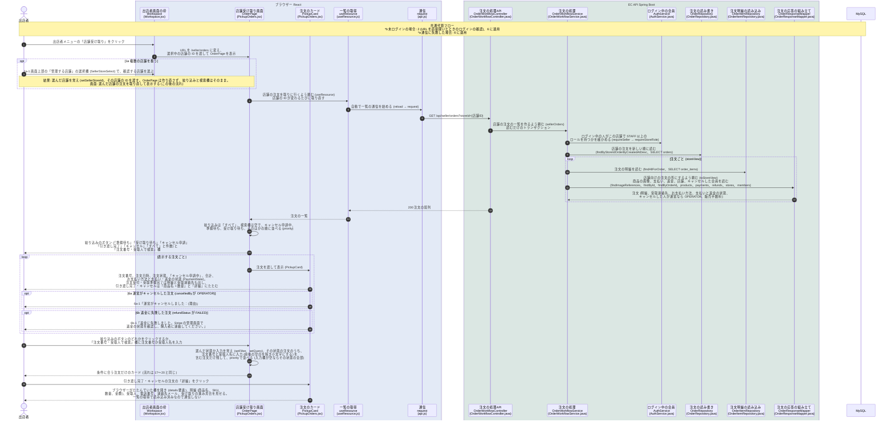

# EC-S08 注文一覧・詳細を確認する

```mermaid
sequenceDiagram
    autonumber
    actor User as 出店者
    box rgba(47,111,219,0.10) ブラウザー React
        participant Work as 出店者画面の枠<br/>Workspace<br/>(Workspace.jsx)
        participant Page as 店舗受け取り画面<br/>OrderPage<br/>(PickupOrders.jsx)
        participant Card as 注文のカード<br/>PickupCard<br/>(PickupOrders.jsx)
        participant Hook as 一覧の取得<br/>useResource<br/>(useResource.js)
        participant Http as 通信<br/>request<br/>(api.js)
    end
    box rgba(27,127,92,0.12) EC API Spring Boot
        participant Ctrl as 注文の処理API<br/>OrderWorkflowController<br/>(OrderWorkflowController.java)
        participant Svc as 注文の処理<br/>OrderWorkflowService<br/>(OrderWorkflowService.java)
        participant Auth as ログイン中の会員<br/>AuthService<br/>(AuthService.java)
        participant OrderRepo as 注文の読み書き<br/>OrderRepository<br/>(OrderRepository.java)
        participant ItemRepo as 注文明細の読み込み<br/>OrderItemRepository<br/>(OrderItemRepository.java)
        participant Mapper as 注文の応答の組み立て<br/>OrderResponseMapper<br/>(OrderResponseMapper.java)
    end
    participant Db as MySQL

    Note over User,Db: 共通代替フロー<br/>*b 未ログインの場合: 2 (URL を直接開いたときのログインの確認)、6 に適用<br/>*a 通信に失敗した場合: 6 に適用

    User->>Work: 出店者メニューの「店舗受け取り」をクリック
    Work->>Page: URL を /seller/orders に変え、<br/>選択中の店舗の ID を渡して OrderPage を表示
    opt 1a 複数の店舗を扱う
        User->>Work: 1a-1 画面上部の「管理する店舗」の選択欄 (SellerStoreSelect) で、確認する店舗を選ぶ
        Note over User,Page: 結果: 選んだ店舗を覚え (setSellerStoreId)、その店舗の ID を渡す。OrderPage は作り直さず、絞り込みと検索欄はそのまま。<br/>画面: 選んだ店舗の注文を取り直して表示する (この後の流れ)
    end
    Page->>Hook: 店舗の注文を取りに行くよう頼む (useResource)<br/>店舗の ID が変わるたびに取り直す
    Hook->>Http: 自動で一覧の通信を始める (reload → request)
    Http->>Ctrl: GET /api/seller/orders?storeId={店舗ID}
    Ctrl->>Svc: 店舗の注文の一覧を作るよう頼む (sellerOrders)<br/>読むだけのトランザクション
    Svc->>Auth: ログイン中の人がこの店舗で STAFF 以上の<br/>ロールを持つかを確かめる (requireSeller → requireStoreRole)
    Svc->>OrderRepo: 店舗の注文を新しい順に読む<br/>(findByStoreIdOrderByCreatedAtDesc、SELECT orders)
    loop 注文ごと (storeView)
        Svc->>ItemRepo: 注文の明細を読む (findAllForOrder、SELECT order_items)
        Svc->>Mapper: 店舗向けの注文の形にするよう頼む (toStoreView)<br/>商品の画像、支払い、返金、店舗、キャンセルした会員を読む<br/>(findImageReferences、findById、findByOrderId。products、payments、refunds、stores、members)
        Mapper-->>Svc: 注文 (明細、受取連絡先、お支払い方法、支払いと返金の状態、<br/>キャンセルした人が運営なら OPERATOR、販売手数料)
    end
    Ctrl-->>Hook: 200 注文の配列
    Hook-->>Page: 注文の一覧
    Page->>Page: 絞り込みは「すべて」、検索欄は空で、キャンセル申請中、<br/>準備待ち、受け取り待ち、そのほかの順に並べる (priority)
    Page-->>User: 絞り込みのボタン (「準備待ち」「受け取り待ち」「キャンセル申請」<br/>「引き渡し完了」「キャンセル」「すべて」と件数) と<br/>「注文番号・受取人で検索」欄
    loop 表示する注文ごと
        Page->>Card: 注文を渡して表示 (PickupCard)
        Card-->>User: 注文番号、注文日時、注文状態、「キャンセル申請中」、合計、<br/>お支払い方法と支払い・返金の状態 (PaymentState)。<br/>注文受付・受取準備完了は明細と受取連絡先も出し、<br/>引き渡し完了・キャンセルは「商品名 × 数量」と「詳細」にたたむ
        opt 6a 運営がキャンセルした注文 (cancelledBy が OPERATOR)
            Card-->>User: 6a-1「運営がキャンセルしました：(理由)」
        end
        opt 6b 返金に失敗した注文 (refundStatus が FAILED)
            Card-->>User: 6b-1「返金に失敗しました。Stripe の管理画面で<br/>返金の状態を確認し、購入者に連絡してください。」
        end
    end

    User->>Page: 絞り込みのボタンのどれかをクリックするか、<br/>「注文番号・受取人で検索」欄に注文番号か受取人名を入力
    Page->>Page: 選んだ状態か入力を覚え (setFilter、setQuery)、その状態の注文のうち、<br/>注文番号と受取人名に入力 (前後の空白を除き小文字にする) を<br/>含む注文だけ残して、priority で並べる (入力欄が空ならその状態の全部)
    Page-->>User: 条件に合う注文だけのカード (流れは 17〜20 と同じ)
    User->>Card: 引き渡し完了・キャンセルの注文の「詳細」をクリック
    Card-->>User: ブラウザーがたたんでいた欄を開き (details 要素)、明細 (商品名、SKU、<br/>数量、金額)、受取人、電話番号、連絡先メール、受け取りの進み具合を見せる。<br/>一覧の取得で読み込み済みなので通信しない
```

