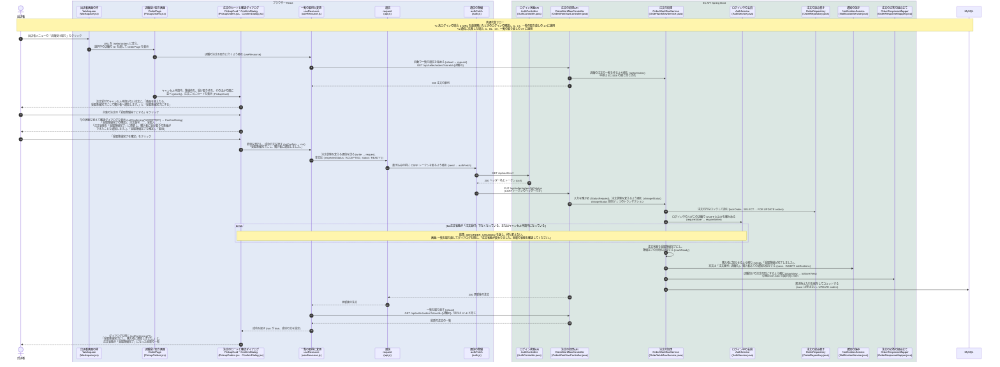

# EC-S09 注文を受取準備完了にする

```mermaid
sequenceDiagram
    autonumber
    actor User as 出店者
    box rgba(47,111,219,0.10) ブラウザー React
        participant Work as 出店者画面の枠<br/>Workspace<br/>(Workspace.jsx)
        participant Page as 店舗受け取り画面<br/>OrderPage<br/>(PickupOrders.jsx)
        participant Card as 注文のカードと確認ダイアログ<br/>PickupCard・ConfirmDialog<br/>(PickupOrders.jsx、ConfirmDialog.jsx)
        participant Hook as 一覧の取得と変更<br/>useResource<br/>(useResource.js)
        participant Http as 通信<br/>request<br/>(api.js)
        participant AuthJs as 通信の準備<br/>authFetch<br/>(auth.js)
    end
    box rgba(27,127,92,0.12) EC API Spring Boot
        participant AuthCtrl as ログイン状態API<br/>AuthController<br/>(AuthController.java)
        participant Ctrl as 注文の処理API<br/>OrderWorkflowController<br/>(OrderWorkflowController.java)
        participant Svc as 注文の処理<br/>OrderWorkflowService<br/>(OrderWorkflowService.java)
        participant Auth as ログイン中の会員<br/>AuthService<br/>(AuthService.java)
        participant OrderRepo as 注文の読み書き<br/>OrderRepository<br/>(OrderRepository.java)
        participant Ntf as 通知の保存<br/>NotificationService<br/>(NotificationService.java)
        participant Mapper as 注文の応答の組み立て<br/>OrderResponseMapper<br/>(OrderResponseMapper.java)
    end
    participant Db as MySQL

    Note over User,Db: 共通代替フロー<br/>*b 未ログインの場合: 2 (URL を直接開いたときのログインの確認)、4、17、一覧の取り直しの 27 に適用<br/>*a 通信に失敗した場合: 4、15、17、一覧の取り直しの 27 に適用

    User->>Work: 出店者メニューの「店舗受け取り」をクリック
    Work->>Page: URL を /seller/orders に変え、<br/>選択中の店舗の ID を渡して OrderPage を表示
    Page->>Hook: 店舗の注文を取りに行くよう頼む (useResource)
    Hook->>Ctrl: 自動で一覧の通信を始める (reload → request)<br/>GET /api/seller/orders?storeId={店舗ID}
    Ctrl->>Svc: 店舗の注文の一覧を作るよう頼む (sellerOrders)<br/>中身は EC-S08 の図と同じ流れ
    Ctrl-->>Hook: 200 注文の配列
    Page->>Card: キャンセル申請中、準備待ち、受け取り待ち、そのほかの順に<br/>並べ (priority)、注文ごとにカードを表示 (PickupCard)
    Card-->>User: 注文受付でキャンセル申請がない注文に、「商品を揃えたら、<br/>受取準備完了にして購入者へ通知します。」と「受取準備完了にする」
    User->>Card: 対象の注文の「受取準備完了にする」をクリック
    Card-->>User: 今の状態を覚えて確認ダイアログを表示 (setConfirming('ACCEPTED') → ConfirmDialog)<br/>「受取準備完了の確認」、注文番号：…、受取人：…、<br/>「注文状態を「受取準備完了」に更新し、購入者に受け取りの準備が<br/>できたことを通知します。」、「受取準備完了を確定」、「取消」
    User->>Card: 「受取準備完了を確定」をクリック
    Card->>Hook: 変更を実行し、成功の文を渡す (onConfirm → run)<br/>「受取準備完了にし、購入者に通知しました。」
    Hook->>Http: 注文状態を変える通信を送る (write → request、<br/>本文は { expectedStatus: 'ACCEPTED', status: 'READY' })
    Http->>AuthJs: 書き込みの前に CSRF トークンを取るよう頼む (send → authFetch)
    AuthJs->>AuthCtrl: GET /api/auth/csrf
    AuthCtrl-->>AuthJs: 200 ヘッダー名とトークン (csrf)
    AuthJs->>Ctrl: PUT /api/seller/orders/{id}/status<br/>(CSRF トークンのヘッダー付き)
    Ctrl->>Svc: 入力を確かめ (StatusRequest)、注文状態を変えるよう頼む (changeStatus)<br/>changeStatus 全体が 1 つのトランザクション
    Svc->>OrderRepo: 注文の行をロックして読む (lockOrder、SELECT ... FOR UPDATE orders)
    Svc->>Auth: ログイン中の人がこの店舗で STAFF 以上かを確かめる<br/>(requireStore → requireSeller)
    break 6a 注文状態が「注文受付」でなくなっている、またはキャンセル申請中になっている
        Note over Auth,Card: 結果: 409 ORDER_CHANGED を返し、何も変えない。<br/>画面: 一覧を取り直してダイアログを閉じ、「注文状態が変わりました。最新の状態を確認してください。」
    end
    Svc->>Svc: 注文状態を受取準備完了にし、<br/>準備完了の日時を記録する (markReady)
    Svc->>Ntf: 購入者に知らせるよう頼む (send)。「受取準備が完了しました」、<br/>本文は「注文番号 / 店舗名」。購入者あての通知を保存する (save、INSERT notifications)
    Svc->>Mapper: 店舗向けの注文の形にするよう頼む (storeView → toStoreView)<br/>中身は EC-S08 の図と同じ流れ
    Svc->>Db: 書き換えた行を保存してコミットする<br/>(save は呼ばない。UPDATE orders)
    Ctrl-->>Http: 200 更新後の注文
    Http-->>Hook: 更新後の注文
    Hook->>Ctrl: 一覧を取り直す (reload)<br/>GET /api/seller/orders?storeId={店舗ID}。流れは 4〜6 と同じ
    Ctrl-->>Hook: 最新の注文の一覧
    Hook-->>Card: 成功を返す (run が true、成功の文を設定)
    Card-->>User: ダイアログを閉じ (setConfirming(''))、<br/>「受取準備完了にし、購入者に通知しました。」と、<br/>注文状態が「受取準備完了」になった最新の一覧
```

