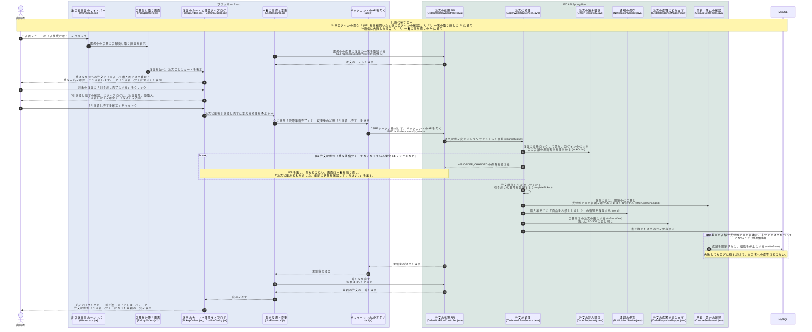

# EC-S10 注文を引き渡し完了にする

```mermaid
sequenceDiagram
    autonumber
    actor User as 出店者
    box rgba(47,111,219,0.10) ブラウザー React
        participant Work as 出店者画面のサイドバー<br/>(Workspace.jsx)
        participant Page as 店舗受け取り画面<br/>(PickupOrders.jsx)
        participant Card as 注文のカードと確認ダイアログ<br/>(PickupOrders.jsx、ConfirmDialog.jsx)
        participant Hook as 一覧の取得と変更<br/>(useResource.js)
        participant Http as バックエンドのAPIを叩く<br/>(api.js)
    end
    box rgba(27,127,92,0.12) EC API Spring Boot
        participant Ctrl as 注文の処理API<br/>(OrderWorkflowController.java)
        participant Svc as 注文の処理<br/>(OrderWorkflowService.java)
        participant OrderRepo as 注文の読み書き<br/>(OrderRepository.java)
        participant Ntf as 通知の保存<br/>(NotificationService.java)
        participant Mapper as 注文の応答の組み立て<br/>(OrderResponseMapper.java)
        participant Close as 閉鎖・停止の確認<br/>(ClosureSettlement.java)
    end
    participant Db as MySQL

    Note over User,Db: 共通代替フロー<br/>*b 未ログインの場合: 2 (URL を直接開いたときのログインの確認)、3、12、一覧の取り直しの 24 に適用<br/>*a 通信に失敗した場合: 3、12、一覧の取り直しの 24 に適用

    User->>Work: 出店者メニューの「店舗受け取り」をクリック
    Work->>Page: 選択中の店舗の店舗受け取り画面を表示
    Hook->>Ctrl: 選択中の店舗の注文の一覧を取得する<br/>GET /api/seller/orders?storeId={店舗ID}
    Ctrl-->>Hook: 注文のリストを返す
    Page->>Card: 注文を並べ、注文ごとにカードを表示
    Card-->>User: 受け取り待ちの注文に「来店した購入者に注文番号と<br/>受取人名を確認して引き渡します。」と「引き渡し完了にする」を表示
    User->>Card: 対象の注文の「引き渡し完了にする」をクリック
    Card-->>User: 「引き渡し完了の確認」のダイアログに、注文番号、受取人、<br/>「引き渡し完了を確定」、「取消」を表示
    User->>Card: 「引き渡し完了を確定」をクリック
    Card->>Hook: 注文状態を引き渡し完了に変える処理を呼ぶ (run)
    Hook->>Http: 今の状態「受取準備完了」と、変更後の状態「引き渡し完了」を送る
    Http->>Ctrl: CSRF トークンを付けて、バックエンドのAPIを叩く<br/>PUT /api/seller/orders/{id}/status
    Ctrl->>Svc: 注文状態を変えるトランザクションを開始 (changeStatus)
    Svc->>OrderRepo: 注文の行をロックして読み、ログイン中の人が<br/>この店舗の担当者かを確かめる (lockOrder)
    break 6a 注文状態が「受取準備完了」でなくなっている場合 (キャンセルなど)
        Svc--xCtrl: 409 ORDER_CHANGED の例外を投げる
        Note over Ctrl,Card: 409 を返し、何も変えない。画面は一覧を取り直し、<br/>「注文状態が変わりました。最新の状態を確認してください。」を出す。
    end
    Svc->>Svc: 注文状態を引き渡し完了にし、<br/>引き渡しの日時を記録する (completePickup)
    Svc->>Close: 保存の後に、閉鎖中の店舗と<br/>受付停止中の組織を確かめる処理を登録する (afterOrderChanged)
    Svc->>Ntf: 購入者あての「商品をお渡ししました」の通知を保存する (send)
    Svc->>Mapper: 店舗向けの注文の形にする (toStoreView)<br/>流れは EC-S08 の図と同じ
    Svc->>Db: 書き換えた注文の行を保存する
    opt 閉鎖中の店舗か受付停止中の組織に、未完了の注文が残っていないとき (関連情報)
        Close->>Db: 店舗を閉鎖済みに、組織を停止にする (settleStore)
        Note over Close,Db: 失敗してもログに残すだけで、出店者への応答は変えない。
    end
    Ctrl-->>Http: 更新後の注文を返す
    Http-->>Hook: 更新後の注文
    Hook->>Ctrl: 一覧を取り直す<br/>流れは 3〜4 と同じ
    Ctrl-->>Hook: 最新の注文の一覧を返す
    Hook-->>Card: 成功を返す
    Card-->>User: ダイアログを閉じ、「引き渡し完了にしました。」と、<br/>注文状態が「引き渡し完了」になった最新の一覧を表示
```

