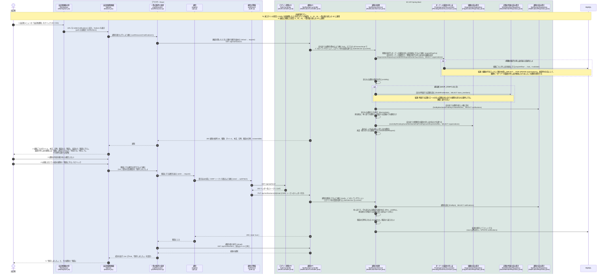

# EC-S11 イベント通知を確認する

```mermaid
sequenceDiagram
    autonumber
    actor User as 出店者
    box rgba(47,111,219,0.10) ブラウザー React
        participant Work as 出店者画面の枠<br/>Workspace<br/>(Workspace.jsx)
        participant Page as 出店者通知画面<br/>Notices<br/>(Notices.jsx)
        participant Hook as 一覧の取得と変更<br/>useResource<br/>(useResource.js)
        participant Http as 通信<br/>request<br/>(api.js)
        participant AuthJs as 通信の準備<br/>authFetch<br/>(auth.js)
    end
    box rgba(27,127,92,0.12) EC API Spring Boot
        participant AuthCtrl as ログイン状態API<br/>AuthController<br/>(AuthController.java)
        participant Ctrl as 通知API<br/>NotificationController<br/>(NotificationController.java)
        participant Svc as 通知の処理<br/>NotificationService<br/>(NotificationService.java)
        participant Pend as オーナーの譲渡の申し出<br/>PendingOwnerSuccession<br/>(PendingOwnerSuccession.java)
        participant Org as 組織の読み書き<br/>OrganizationRepository<br/>(OrganizationRepository.java)
        participant SM as 店舗の所属の読み書き<br/>StoreMemberRepository<br/>(StoreMemberRepository.java)
        participant Repo as 通知の読み書き<br/>NotificationRepository<br/>(NotificationRepository.java)
    end
    participant Db as MySQL

    Note over User,Db: 共通代替フロー<br/>*b 未ログインの場合: 2 (URL を直接開いたときのログインの確認)、4、22、24、一覧の取り直しの 32 に適用<br/>*a 通信に失敗した場合: 4、22、24、一覧の取り直しの 32 に適用

    User->>Work: 1 出店者メニューの「出店者通知」をクリック (EC-C03)
    Work->>Page: URL を /seller/notifications に変え、Notices を表示<br/>(path の末尾が /notifications)
    Page->>Hook: 通知を取りに行くよう頼む (useResource('/notifications'))
    Hook->>Ctrl: 画面を開いたときに自動で通信を始める (reload → request)<br/>GET /api/notifications
    Ctrl->>Svc: 自分あての通知を集めるよう頼む (list)。クラスの @Transactional で<br/>1 つのトランザクション。ログイン中の会員を調べる (AuthService の current)
    Svc->>Pend: 期限が過ぎたオーナーの譲渡の申し出を無効にするよう頼む (expireIfDueFor)<br/>自分がオーナーか譲渡先で、期限が過ぎた申し出のある組織を探す<br/>(OrganizationRepository.findIdsWithExpiredOwnerSuccession、SELECT organizations)
    opt 期限が過ぎた申し出がある (記述なし)
        Pend->>Db: 組織ごとに申し出を無効にする (expireIfDue → lock、invalidate)
        Note over Pend,Db: 結果: 組織の行をロックして確かめ直し (SELECT ... FOR UPDATE organizations)、承認待ちを空にして、<br/>履歴と「オーナーの譲渡の申し出が無効になりました」の通知を保存する
    end
    Svc->>Svc: 見られる通知の条件を作る (visibility)
    opt 担当者 (SHOP_STAFF) のとき
        Svc->>SM: 自分が所属する店舗を読む (findAllForMember、SELECT store_members)
        Note over Svc,SM: 結果: 所属する店舗 (ロールのない店舗を含む) あての通知も見られる条件にする。<br/>画面: 変わらない
    end
    Svc->>Repo: 自分あての通知を新しい順に読む<br/>(findByMemberIdOrderByCreatedAtDesc、SELECT notifications)
    Svc->>Svc: 見られる通知だけを残す (filter(visible))。<br/>担当者は、本人あての通知と、所属する店舗あての通知だけ
    Svc->>Org: 自分あての期限内の譲渡の申し出があるかを調べる<br/>(existsByPendingOwnerMemberIdAndPendingOwnerExpiresAtAfter、SELECT organizations)
    Svc->>Svc: あれば、いちばん新しい申し出の通知を<br/>承認・断りのできる通知にする (answerableRequest)
    Ctrl-->>Hook: 200 通知の配列 (id、種類、タイトル、本文、日時、既読の日時、answerable)
    Hook-->>Page: 通知
    Page-->>User: 2 通知ごとのタイトル、本文、日時。既読なら「既読」、未読なら「既読にする」。<br/>譲渡の申し出の通知には「重要」(承認できるなら「承認する」「断る」も。<br/>その操作は図では省略)
    User->>Page: 3 通知の内容を確かめる (通信しない)

    User->>Page: 4 (必要に応じて) 未読の通知の「既読にする」をクリック
    Page->>Hook: 既読にする通信を実行するよう頼む<br/>(run。成功の文は既定の「保存しました。」)
    Hook->>Http: 既読にする通信を送る (write → request)
    Http->>AuthJs: 書き込みの前に CSRF トークンを取るよう頼む (send → authFetch)
    AuthJs->>AuthCtrl: GET /api/auth/csrf
    AuthCtrl-->>AuthJs: 200 ヘッダー名とトークン (csrf)
    AuthJs->>Ctrl: PUT /api/notifications/{id}/read (CSRF トークンのヘッダー付き)
    Ctrl->>Svc: 通知を既読にするよう頼む (read)。1 つのトランザクション<br/>ログイン中の会員を調べる (AuthService の current)
    Svc->>Repo: 通知を読む (findById、SELECT notifications)
    Svc->>Svc: 本人あてで、今も見られる通知かを確かめる (filter、visibility)。<br/>担当者なら所属する店舗を読む (流れは 9 と同じ)
    Svc->>Svc: 既読の日時を入れる (markRead。既読なら変えない)
    Svc->>Db: 変更を保存してコミットする<br/>(save は呼ばない。UPDATE notifications)
    Ctrl-->>Http: 200 { read: true }
    Http-->>Hook: 既読にした
    Hook->>Ctrl: 通知を取り直す (reload)<br/>GET /api/notifications。流れは 4〜14 と同じ
    Ctrl-->>Hook: 最新の通知
    Hook-->>Page: 成功を返す (run が true、「保存しました。」を設定)
    Page-->>User: 5「保存しました。」と、その通知の「既読」
```

