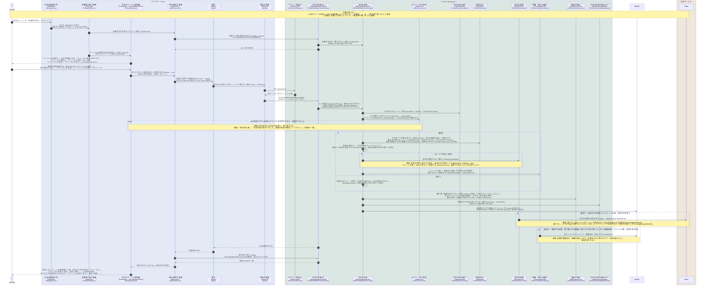

# EC-S13 注文キャンセル申請を処理する

```mermaid
sequenceDiagram
    autonumber
    actor User as 出店者
    box rgba(47,111,219,0.10) ブラウザー React
        participant Work as 出店者画面の枠<br/>Workspace<br/>(Workspace.jsx)
        participant Page as 店舗受け取り画面<br/>OrderPage<br/>(PickupOrders.jsx)
        participant Card as 注文のカードと回答欄<br/>PickupCard・CancellationDecision<br/>(PickupOrders.jsx)
        participant Hook as 一覧の取得と変更<br/>useResource<br/>(useResource.js)
        participant Http as 通信<br/>request<br/>(api.js)
        participant AuthJs as 通信の準備<br/>authFetch<br/>(auth.js)
    end
    box rgba(27,127,92,0.12) EC API Spring Boot
        participant AuthCtrl as ログイン状態API<br/>AuthController<br/>(AuthController.java)
        participant Ctrl as 注文の処理API<br/>OrderWorkflowController<br/>(OrderWorkflowController.java)
        participant Svc as 注文の処理<br/>OrderWorkflowService<br/>(OrderWorkflowService.java)
        participant Auth as ログイン中の会員<br/>AuthService<br/>(AuthService.java)
        participant OrderRepo as 注文の読み書き<br/>OrderRepository<br/>(OrderRepository.java)
        participant Stock as 在庫の戻し<br/>StockReturn<br/>(StockReturn.java)
        participant Refund as 返金の依頼<br/>RefundService<br/>(RefundService.java)
        participant Close as 閉鎖・停止の確認<br/>ClosureSettlement<br/>(ClosureSettlement.java)
        participant Ntf as 通知の保存<br/>NotificationService<br/>(NotificationService.java)
        participant Mapper as 注文の応答の組み立て<br/>OrderResponseMapper<br/>(OrderResponseMapper.java)
    end
    participant Db as MySQL
    box rgba(180,120,20,0.12) 外部サービス
        participant Stripe as Stripe
    end

    Note over User,Stripe: 共通代替フロー<br/>*b 未ログインの場合: 2 (URL を直接開いたときのログインの確認)、4、15、一覧の取り直しの 31 に適用<br/>*a 通信に失敗した場合: 4、13、15、一覧の取り直しの 31 に適用

    User->>Work: 出店者メニューの「店舗受け取り」をクリック
    Work->>Page: URL を /seller/orders に変え、<br/>選択中の店舗の ID を渡して OrderPage を表示
    Page->>Hook: 店舗の注文を取りに行くよう頼む (useResource)
    Hook->>Ctrl: 自動で一覧の通信を始める (reload → request)<br/>GET /api/seller/orders?storeId={店舗ID}
    Ctrl->>Svc: 店舗の注文の一覧を作るよう頼む (sellerOrders)<br/>中身は EC-S08 の図と同じ流れ
    Ctrl-->>Hook: 200 注文の配列
    Page->>Card: キャンセル申請中の注文を先にして並べ (priority)、<br/>注文ごとにカードを表示 (PickupCard)
    Card-->>User: 「キャンセル申請中」、注文の明細と合計、「キャンセル申請があります：<br/>(キャンセル理由)」、「キャンセル回答」の入力欄、<br/>「キャンセルを承認」「キャンセルを却下」(CancellationDecision)
    User->>Card: 申請の内容を確かめ、却下するなら「キャンセル回答」に<br/>却下理由を入力し、「キャンセルを承認」か「キャンセルを却下」をクリック
    Card->>Hook: 押したボタンと回答を渡して変更を実行 (decide → run)<br/>成功の文は既定の「保存しました。」
    Hook->>Http: 申請に回答する通信を送る (write → request、<br/>本文は { approved: 承認なら true, reason: 回答 })
    Http->>AuthJs: 書き込みの前に CSRF トークンを取るよう頼む (send → authFetch)
    AuthJs->>AuthCtrl: GET /api/auth/csrf
    AuthCtrl-->>AuthJs: 200 ヘッダー名とトークン (csrf)
    AuthJs->>Ctrl: PUT /api/seller/orders/{id}/cancellation<br/>(CSRF トークンのヘッダー付き)
    Ctrl->>Svc: 入力を確かめ (DecisionRequest、回答は 500 文字まで)、<br/>申請に回答するよう頼む (decideCancellation)<br/>decideCancellation 全体が 1 つのトランザクション
    Svc->>OrderRepo: 注文の行をロックして読む (lockOrder、SELECT ... FOR UPDATE orders)
    Svc->>Auth: この店舗で STAFF 以上か (requireStore → requireSeller)、<br/>オーナーか MANAGER か (requireManager → requireStoreRole) を確かめる
    break 6b 申請がすでに処理されている (注文受付でない、申請中でない)
        Note over Auth,Card: 結果: 409 ORDER_CHANGED を返し、何も変えない。<br/>画面: 一覧を取り直し、「注文状態が変わりました。最新の状態を確認してください。」と最新の一覧。
    end
    alt 承認
        Svc->>Stock: 引き当てた在庫を戻すよう頼む (restock)。注文の明細を読み、在庫の行を<br/>商品 ID の順にロックして (findAllForOrder、lockAll の SELECT ... FOR UPDATE inventory)、<br/>在庫の数量に注文の数量を足す (setQuantity。在庫の行がなければ 409 STOCK_NOT_FOUND)
        Svc->>Svc: 申請を承認にし、注文状態をキャンセルにして、<br/>回答した会員を記録する (decideCancellation。回答は前後の空白を除いて保存)
        opt カードで支払い済み
            Svc->>Refund: 返金を依頼するよう頼む (refundCancelledOrder)
            Note over Svc,Refund: 結果: 返金の有無と支払いを読み、返金の行を保存して (findByOrderId、findById、save)、<br/>コミットの後に Stripe を呼ぶよう登録する (AfterCommit.run)。店舗でお支払いのときは何もしない
        end
        Svc->>Close: コミットの後に、閉鎖中の店舗・受付停止中の組織を<br/>確かめるよう登録する (afterOrderChanged → AfterCommit.run)
    else 却下
        Svc->>Svc: 申請を却下にし、回答した会員を記録する。注文状態は変えない<br/>(decideCancellation。回答は前後の空白を除いて保存)
    end
    Svc->>Ntf: 購入者に結果を知らせるよう頼む (send)。承認は「注文をキャンセルしました」、<br/>却下は「キャンセル申請の結果」、本文は「注文番号 回答」。<br/>購入者あての通知を保存する (save、INSERT notifications)
    Svc->>Mapper: 店舗向けの注文の形にするよう頼む (storeView → toStoreView)<br/>中身は EC-S08 の図と同じ流れ
    Svc->>Db: 書き換えた行を保存してコミットする (save は呼ばない。<br/>UPDATE orders、承認なら UPDATE inventory と INSERT refunds)
    opt 承認で、返金の行を保存した (コミットの後、応答を返す前)
        Refund->>Stripe: 注文の金額の返金を作る (send → StripeGateway.createRefund)
        Note over Refund,Stripe: 結果: 届けば、別のトランザクションで返金の行に Stripe の返金の ID を記録する (attachStripeRefund)。<br/>届かない、または Stripe の鍵がないときは、別のトランザクションで返金の行を「返金の失敗」にする (changeStatus(FAILED))
    end
    opt 承認で、閉鎖中の店舗・受付停止中の組織に未完了の注文が残っていない (関連情報。コミットの後、応答を返す前)
        Close->>Db: 別のトランザクションで、閉鎖済み・停止にする (settleStore)
        Note over Close,Db: 結果: 店舗を閉鎖済み・組織を停止にする。失敗はログに残すだけで、応答は変えない。<br/>画面: 変わらない
    end
    Ctrl-->>Http: 200 更新後の注文
    Http-->>Hook: 更新後の注文
    Hook->>Ctrl: 一覧を取り直す (reload)<br/>GET /api/seller/orders?storeId={店舗ID}。流れは 4〜6 と同じ
    Ctrl-->>Hook: 最新の注文の一覧
    Hook-->>Card: 成功を返す (run が true、成功の文を設定)
    Card-->>User: 「保存しました。」と処理結果の一覧。承認なら注文状態が「キャンセル」、<br/>「キャンセル申請（承認）：理由 / 回答：…」と返金の状態。<br/>却下なら注文状態はそのままで、「キャンセル申請（却下）：理由 / 回答：…」
```

