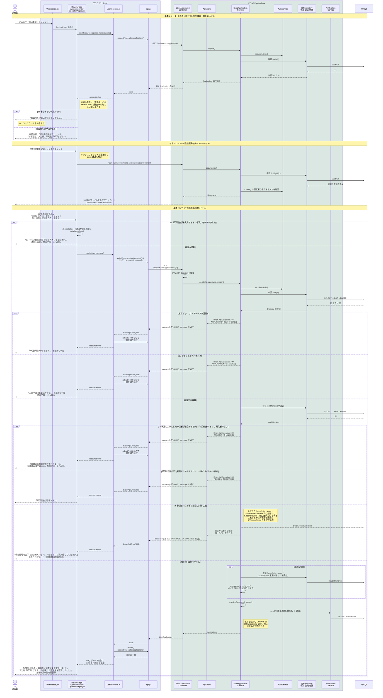

## EC-A03 出店申請を審査する

```mermaid
sequenceDiagram
    actor User as 運営者
    box rgba(47,111,219,0.10) ブラウザー React
        participant Work as Workspace.jsx
        participant Page as ReviewPage<br/>ApplicationRow<br/>OperatorPages.jsx
        participant Hook as useResource.js
        participant Http as api.js
    end
    box rgba(27,127,92,0.12) EC API Spring Boot
        participant Ctrl as StoreApplication<br/>Controller
        participant Errs as ApiErrors
        participant Svc as StoreApplication<br/>Service
        participant Auth as AuthService
        participant Repo as 各Repository<br/>申請 会員 店舗
        participant Ntf as Notification<br/>Service
    end
    participant Db as MySQL

    Note over User,Db: 基本フロー 1〜3 画面を開いて出店申請の一覧を表示する
    User->>Work: メニュー「出店審査」をクリック
    Work->>Page: ReviewPage を表示
    Page->>Hook: useResource('/operator/applications')
    Hook->>Http: request('/operator/applications')
    Http->>Ctrl: GET /api/operator/applications
    Ctrl->>Svc: list(true)
    Svc->>Auth: requireAdmin()
    Svc->>Repo: 申請 findAll()
    Repo->>Db: SELECT
    Db-->>Repo: 行
    Repo-->>Svc: 申請のリスト
    Svc-->>Ctrl: Application のリスト
    Ctrl-->>Http: 200 Application の配列
    Http-->>Hook: data
    Hook-->>Page: resource.data
    Note right of Page: 初期の表示は「審査中」のみ<br/>reviewOrder で審査中を先に<br/>古い順に並べる
    alt 3a 審査待ちの申請がない
        Page-->>User: 「審査待ちの出店申請はありません。」
        Note right of User: 3a-2 ユースケースを終了する
    else 審査待ちの申請がある
        Page-->>User: 申請内容、「提出書類を確認」リンク、<br/>「却下理由」入力欄、「承認」「却下」ボタン
    end

    Note over User,Db: 基本フロー 4〜5 提出書類をダウンロードする
    User->>Page: 「提出書類を確認」リンクをクリック
    Note right of Page: リンクはブラウザーが直接開く<br/>api.js は通らない
    Page->>Ctrl: GET /api/account/store-applications/{id}/document
    Ctrl->>Svc: document(id)
    Svc->>Repo: 申請 findById(id)
    Repo->>Db: SELECT
    Db-->>Repo: 申請と書類の中身
    Svc->>Auth: current() で運営者か申請者本人かを確認
    Svc-->>Ctrl: Document
    Ctrl-->>User: 200 添付ファイルとしてダウンロード<br/>Content-Disposition attachment

    Note over User,Db: 基本フロー 6〜9 承認または却下する
    User->>Page: 内容と書類を確認し<br/>「承認」または「却下」をクリック<br/>却下は却下理由を入力してから
    alt 6a 却下理由が未入力のまま「却下」をクリックした
        Page->>Page: decide(false) で理由が空と判定し<br/>setMissing(true)
        Page-->>User: 「却下する場合は却下理由を入力してください。」<br/>通信しない。基本フロー 6 へ戻る
    else 審査へ進む
        Page->>Hook: run(action, message)
        Hook->>Http: write('/operator/applications/{id}',<br/>'PUT', { approved, reason })
        Http->>Ctrl: PUT<br/>/api/operator/applications/{id}
        Ctrl->>Ctrl: @Valid が Decision を検査
        Ctrl->>Svc: decide(id, approved, reason)
        Svc->>Auth: requireAdmin()
        Svc->>Repo: 申請 lock(id)
        Repo->>Db: SELECT ... FOR UPDATE
        Db-->>Repo: 行 または 空
        Repo-->>Svc: Optional の申請
        alt 申請がない (ユースケース未記載)
            Svc--xErrs: throw ApiException(404,<br/>APPLICATION_NOT_FOUND)
            Errs-->>Http: business() が 404 と message を返す
            Http--xHook: throw ApiError(404)
            Hook->>Http: reload() 404 なので<br/>一覧を取り直す
            Hook-->>Page: resource.error
            Page-->>User: 「申請が見つかりません。」と最新の一覧
        else 7a すでに処理されている
            Svc--xErrs: throw ApiException(409,<br/>APPLICATION_CHANGED)
            Errs-->>Http: business() が 409 と message を返す
            Http--xHook: throw ApiError(409)
            Hook->>Http: reload() 409 なので<br/>一覧を取り直す
            Hook-->>Page: resource.error
            Page-->>User: 「この申請は審査済みです。」と最新の一覧<br/>基本フロー 2 へ戻る
        else 審査中の申請
            Svc->>Repo: 会員 lockMember(申請者)
            Repo->>Db: SELECT ... FOR UPDATE
            Db-->>Repo: 行
            Repo-->>Svc: AuthMember
            alt 7c 承認しようとした申請者が退会済み または 利用停止中 または 購入者でない
                Svc--xErrs: throw ApiException(409,<br/>MEMBER_CHANGED)
                Errs-->>Http: business() が 409 と message を返す
                Http--xHook: throw ApiError(409)
                Hook->>Http: reload() 409 なので<br/>一覧を取り直す
                Hook-->>Page: resource.error
                Page-->>User: 「申請者の利用状態が変わりました。」<br/>申請は審査中のまま。基本フロー 6 へ戻る
            else 却下で理由が空 (画面で止めるのでサーバー側の念のための検査)
                Svc--xErrs: throw ApiException(400,<br/>REASON_REQUIRED)
                Errs-->>Http: business() が 400 と message を返す
                Http--xHook: throw ApiError(400)
                Hook-->>Page: resource.error
                Page-->>User: 「却下理由が必要です。」
            else 7b 承認または却下の処理に失敗した
                Note right of Svc: 承認なら StoreEntity.create と<br/>stores.saveAndFlush で店舗を作り<br/>m.approveStore で出店者へ切り替える<br/>これらと申請の更新と通知は<br/>@Transactional の 1 つの処理
                Db--xSvc: DataAccessException
                Svc--xErrs: 例外が伝わり全体が<br/>ロールバックされる
                Errs-->>Http: database() が 503 DATABASE_UNAVAILABLE を返す
                Http--xHook: throw ApiError(503)
                Hook-->>Page: resource.error
                Page-->>User: 「保存処理を完了できませんでした。時間をおいて再試行してください。」<br/>状態・アカウント・店舗は処理前のまま
            else 承認または却下できる
                opt 承認の場合
                    Svc->>Repo: 店舗 StoreEntity.create と<br/>updateProfile 営業時間は「未設定」
                    Repo->>Db: INSERT stores
                    Svc->>Svc: m.approveStore(storeId)<br/>role を SELLER に切り替える
                end
                Svc->>Svc: a.review(approved, reason)
                Svc->>Ntf: send(申請者, 結果, 会社名 と 理由)
                Ntf->>Db: INSERT notifications
                Note right of Svc: 申請と会員の UPDATE は<br/>@Transactional の終了時に<br/>まとめて保存される
                Svc-->>Ctrl: Application
                Ctrl-->>Http: 200 Application
                Http-->>Hook: data
                Hook->>Http: reload()<br/>request('/operator/applications')
                Http-->>Hook: 最新の一覧
                Hook-->>Page: run() が true を返す。<br/>data と notice を更新
                Page-->>User: 「承認しました。申請者に審査結果を通知しました。」<br/>または「却下しました。申請者に却下理由を通知しました。」<br/>出店申請一覧を再表示
            end
        end
    end
```