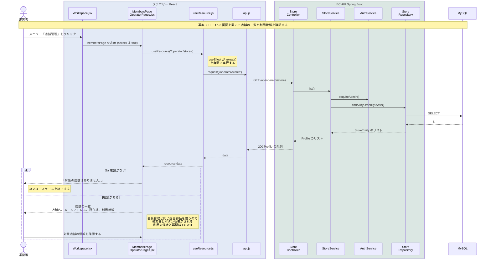

## EC-A05 店舗情報を確認する

```mermaid
sequenceDiagram
    actor User as 運営者
    box rgba(47,111,219,0.10) ブラウザー React
        participant Work as Workspace.jsx
        participant Page as MembersPage<br/>OperatorPages.jsx
        participant Hook as useResource.js
        participant Http as api.js
    end
    box rgba(27,127,92,0.12) EC API Spring Boot
        participant Ctrl as Store<br/>Controller
        participant Svc as StoreService
        participant Auth as AuthService
        participant Repo as Store<br/>Repository
    end
    participant Db as MySQL

    Note over User,Db: 基本フロー 1〜3 画面を開いて店舗の一覧と利用状態を確認する
    User->>Work: メニュー「店舗管理」をクリック
    Work->>Page: MembersPage を表示 (sellers は true)
    Page->>Hook: useResource('/operator/stores')
    Note right of Hook: useEffect が reload()<br/>を自動で実行する
    Hook->>Http: request('/operator/stores')
    Http->>Ctrl: GET /api/operator/stores
    Ctrl->>Svc: list()
    Svc->>Auth: requireAdmin()
    Svc->>Repo: findAllByOrderByIdAsc()
    Repo->>Db: SELECT
    Db-->>Repo: 行
    Repo-->>Svc: StoreEntity のリスト
    Svc-->>Ctrl: Profile のリスト
    Ctrl-->>Http: 200 Profile の配列
    Http-->>Hook: data
    Hook-->>Page: resource.data
    alt 2a 店舗がない
        Page-->>User: 「対象の店舗はありません。」
        Note right of User: 2a-2 ユースケースを終了する
    else 店舗がある
        Page-->>User: 店舗の一覧<br/>店舗名、メールアドレス、所在地、利用状態
        Note right of Page: 会員管理と同じ画面部品を使うので<br/>検索欄とボタンも表示される<br/>利用の停止と再開は EC-A11
        User->>Page: 対象店舗の情報を確認する
    end
```