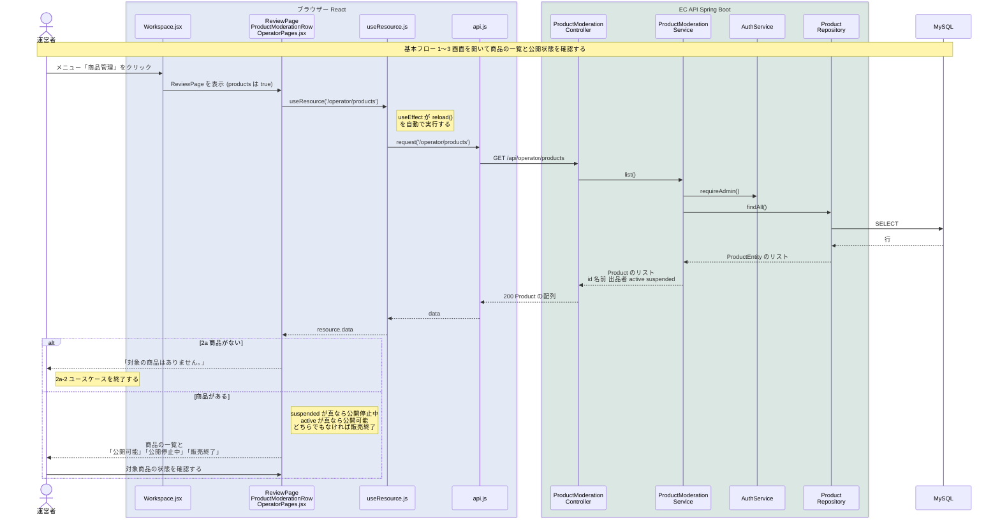

## EC-A06 商品情報を確認する

```mermaid
sequenceDiagram
    actor User as 運営者
    box rgba(47,111,219,0.10) ブラウザー React
        participant Work as Workspace.jsx
        participant Page as ReviewPage<br/>ProductModerationRow<br/>OperatorPages.jsx
        participant Hook as useResource.js
        participant Http as api.js
    end
    box rgba(27,127,92,0.12) EC API Spring Boot
        participant Ctrl as ProductModeration<br/>Controller
        participant Svc as ProductModeration<br/>Service
        participant Auth as AuthService
        participant Repo as Product<br/>Repository
    end
    participant Db as MySQL

    Note over User,Db: 基本フロー 1〜3 画面を開いて商品の一覧と公開状態を確認する
    User->>Work: メニュー「商品管理」をクリック
    Work->>Page: ReviewPage を表示 (products は true)
    Page->>Hook: useResource('/operator/products')
    Note right of Hook: useEffect が reload()<br/>を自動で実行する
    Hook->>Http: request('/operator/products')
    Http->>Ctrl: GET /api/operator/products
    Ctrl->>Svc: list()
    Svc->>Auth: requireAdmin()
    Svc->>Repo: findAll()
    Repo->>Db: SELECT
    Db-->>Repo: 行
    Repo-->>Svc: ProductEntity のリスト
    Svc-->>Ctrl: Product のリスト<br/>id 名前 出品者 active suspended
    Ctrl-->>Http: 200 Product の配列
    Http-->>Hook: data
    Hook-->>Page: resource.data
    alt 2a 商品がない
        Page-->>User: 「対象の商品はありません。」
        Note right of User: 2a-2 ユースケースを終了する
    else 商品がある
        Note right of Page: suspended が真なら公開停止中<br/>active が真なら公開可能<br/>どちらでもなければ販売終了
        Page-->>User: 商品の一覧と<br/>「公開可能」「公開停止中」「販売終了」
        User->>Page: 対象商品の状態を確認する
    end
```