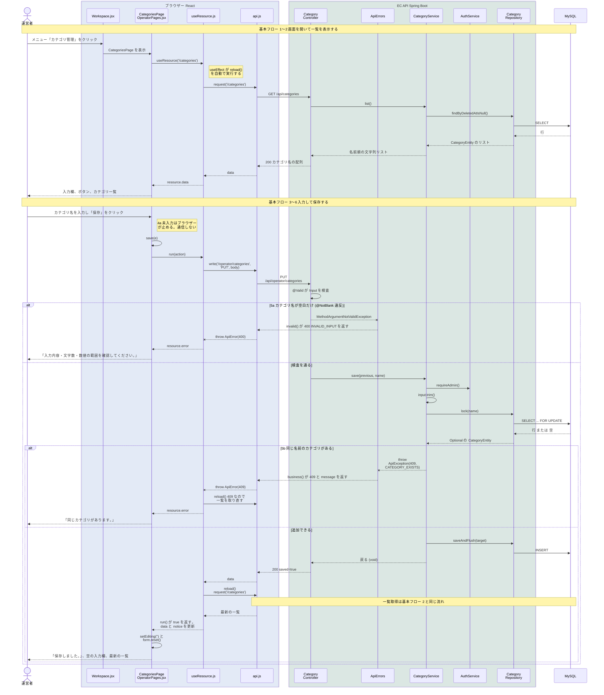

## EC-A07 商品カテゴリを追加する

```mermaid
sequenceDiagram
    actor User as 運営者
    box rgba(47,111,219,0.10) ブラウザー React
        participant Work as Workspace.jsx
        participant Page as CategoriesPage<br/>OperatorPages.jsx
        participant Hook as useResource.js
        participant Http as api.js
    end
    box rgba(27,127,92,0.12) EC API Spring Boot
        participant Ctrl as Category<br/>Controller
        participant Errs as ApiErrors
        participant Svc as CategoryService
        participant Auth as AuthService
        participant Repo as Category<br/>Repository
    end
    participant Db as MySQL

    Note over User,Db: 基本フロー 1〜2 画面を開いて一覧を表示する
    User->>Work: メニュー「カテゴリ管理」をクリック
    Work->>Page: CategoriesPage を表示
    Page->>Hook: useResource('/categories')
    Note right of Hook: useEffect が reload()<br/>を自動で実行する
    Hook->>Http: request('/categories')
    Http->>Ctrl: GET /api/categories
    Ctrl->>Svc: list()
    Svc->>Repo: findByDeletedAtIsNull()
    Repo->>Db: SELECT
    Db-->>Repo: 行
    Repo-->>Svc: CategoryEntity のリスト
    Svc-->>Ctrl: 名前順の文字列リスト
    Ctrl-->>Http: 200 カテゴリ名の配列
    Http-->>Hook: data
    Hook-->>Page: resource.data
    Page-->>User: 入力欄、ボタン、カテゴリ一覧

    Note over User,Db: 基本フロー 3〜6 入力して保存する
    User->>Page: カテゴリ名を入力し「保存」をクリック
    Note right of Page: 4a 未入力はブラウザー<br/>が止める。通信しない
    Page->>Page: save(e)
    Page->>Hook: run(action)
    Hook->>Http: write('/operator/categories',<br/>'PUT', body)
    Http->>Ctrl: PUT<br/>/api/operator/categories
    Ctrl->>Ctrl: @Valid が Input を検査
    alt 5a カテゴリ名が空白だけ (@NotBlank 違反)
        Ctrl--xErrs: MethodArgumentNotValidException
        Errs-->>Http: invalid() が 400 INVALID_INPUT を返す
        Http--xHook: throw ApiError(400)
        Hook-->>Page: resource.error
        Page-->>User: 「入力内容・文字数・数値の範囲を確認してください。」
    else 検査を通る
        Ctrl->>Svc: save(previous, name)
        Svc->>Auth: requireAdmin()
        Svc->>Svc: input.trim()
        Svc->>Repo: lock(name)
        Repo->>Db: SELECT ... FOR UPDATE
        Db-->>Repo: 行 または 空
        Repo-->>Svc: Optional の CategoryEntity
        alt 5b 同じ名前のカテゴリがある
            Svc--xErrs: throw<br/>ApiException(409,<br/>CATEGORY_EXISTS)
            Errs-->>Http: business() が 409 と message を返す
            Http--xHook: throw ApiError(409)
            Hook->>Http: reload() 409 なので<br/>一覧を取り直す
            Hook-->>Page: resource.error
            Page-->>User: 「同じカテゴリがあります。」
        else 追加できる
            Svc->>Repo: saveAndFlush(target)
            Repo->>Db: INSERT
            Svc-->>Ctrl: 戻る (void)
            Ctrl-->>Http: 200 saved=true
            Http-->>Hook: data
            Hook->>Http: reload()<br/>request('/categories')
            Note over Http,Db: 一覧取得は基本フロー 2 と同じ流れ
            Http-->>Hook: 最新の一覧
            Hook-->>Page: run() が true を返す。<br/>data と notice を更新
            Page->>Page: setEditing('') と<br/>form.reset()
            Page-->>User: 「保存しました。」、空の入力欄、最新の一覧
        end
    end
```