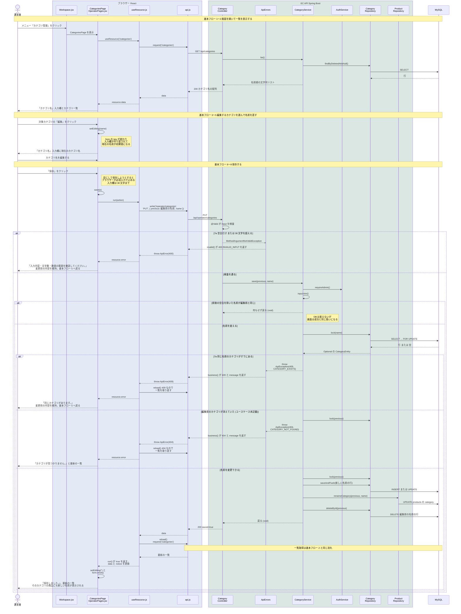

## EC-A08 商品カテゴリを編集する

```mermaid
sequenceDiagram
    actor User as 運営者
    box rgba(47,111,219,0.10) ブラウザー React
        participant Work as Workspace.jsx
        participant Page as CategoriesPage<br/>OperatorPages.jsx
        participant Hook as useResource.js
        participant Http as api.js
    end
    box rgba(27,127,92,0.12) EC API Spring Boot
        participant Ctrl as Category<br/>Controller
        participant Errs as ApiErrors
        participant Svc as CategoryService
        participant Auth as AuthService
        participant Repo as Category<br/>Repository
        participant Prod as Product<br/>Repository
    end
    participant Db as MySQL

    Note over User,Db: 基本フロー 1〜2 画面を開いて一覧を表示する
    User->>Work: メニュー「カテゴリ管理」をクリック
    Work->>Page: CategoriesPage を表示
    Page->>Hook: useResource('/categories')
    Hook->>Http: request('/categories')
    Http->>Ctrl: GET /api/categories
    Ctrl->>Svc: list()
    Svc->>Repo: findByDeletedAtIsNull()
    Repo->>Db: SELECT
    Db-->>Repo: 行
    Svc-->>Ctrl: 名前順の文字列リスト
    Ctrl-->>Http: 200 カテゴリ名の配列
    Http-->>Hook: data
    Hook-->>Page: resource.data
    Page-->>User: 「カテゴリ名」入力欄とカテゴリ一覧

    Note over User,Db: 基本フロー 3〜5 編集するカテゴリを選んで名前を直す
    User->>Page: 対象カテゴリの「編集」をクリック
    Page->>Page: setEditing(name)
    Note right of Page: form の key が変わり<br/>入力欄が作り直されて<br/>現在の名前が初期値になる
    Page-->>User: 「カテゴリ名」入力欄に現在のカテゴリ名
    User->>Page: カテゴリ名を編集する

    Note over User,Db: 基本フロー 6〜8 保存する
    User->>Page: 「保存」をクリック
    Note right of Page: 空にして保存しようとすると<br/>ブラウザーが必須入力で止める<br/>入力欄は 30 文字まで
    Page->>Page: save(e)
    Page->>Hook: run(action)
    Hook->>Http: write('/operator/categories',<br/>'PUT', { previous: 編集前の名前, name })
    Http->>Ctrl: PUT<br/>/api/operator/categories
    Ctrl->>Ctrl: @Valid が Input を検査
    alt 7a 空白だけ または 30 文字を超える
        Ctrl--xErrs: MethodArgumentNotValidException
        Errs-->>Http: invalid() が 400 INVALID_INPUT を返す
        Http--xHook: throw ApiError(400)
        Hook-->>Page: resource.error
        Page-->>User: 「入力内容・文字数・数値の範囲を確認してください。」<br/>変更前の内容を維持。基本フロー 5 へ戻る
    else 検査を通る
        Ctrl->>Svc: save(previous, name)
        Svc->>Auth: requireAdmin()
        Svc->>Svc: input.trim()
        alt 前後の空白を除いた名前が編集前と同じ
            Svc-->>Ctrl: 何もせず戻る (void)
            Note right of Svc: DB は変えないが<br/>画面は成功と同じ扱いになる
        else 名前を変える
            Svc->>Repo: lock(name)
            Repo->>Db: SELECT ... FOR UPDATE
            Db-->>Repo: 行 または 空
            Repo-->>Svc: Optional の CategoryEntity
            alt 7a 同じ名前のカテゴリがすでにある
                Svc--xErrs: throw<br/>ApiException(409,<br/>CATEGORY_EXISTS)
                Errs-->>Http: business() が 409 と message を返す
                Http--xHook: throw ApiError(409)
                Hook->>Http: reload() 409 なので<br/>一覧を取り直す
                Hook-->>Page: resource.error
                Page-->>User: 「同じカテゴリがあります。」<br/>変更前の内容を維持。基本フロー 5 へ戻る
            else 編集前のカテゴリが消えていた (ユースケース未記載)
                Svc->>Repo: lock(previous)
                Svc--xErrs: throw<br/>ApiException(404,<br/>CATEGORY_NOT_FOUND)
                Errs-->>Http: business() が 404 と message を返す
                Http--xHook: throw ApiError(404)
                Hook->>Http: reload() 404 なので<br/>一覧を取り直す
                Hook-->>Page: resource.error
                Page-->>User: 「カテゴリが見つかりません。」と最新の一覧
            else 名前を変更できる
                Svc->>Repo: lock(previous)
                Svc->>Repo: saveAndFlush(新しい名前の行)
                Repo->>Db: INSERT または UPDATE
                Svc->>Prod: renameCategory(previous, name)
                Prod->>Db: UPDATE products の category
                Svc->>Repo: deleteById(previous)
                Repo->>Db: DELETE 編集前の名前の行
                Svc-->>Ctrl: 戻る (void)
                Ctrl-->>Http: 200 saved=true
                Http-->>Hook: data
                Hook->>Http: reload()<br/>request('/categories')
                Note over Http,Db: 一覧取得は基本フロー 2 と同じ流れ
                Http-->>Hook: 最新の一覧
                Hook-->>Page: run() が true を返す。<br/>data と notice を更新
                Page->>Page: setEditing('') と<br/>form.reset()
                Page-->>User: 「保存しました。」、最新の一覧<br/>そのカテゴリの商品にも新しい名前が表示される
            end
        end
    end
```