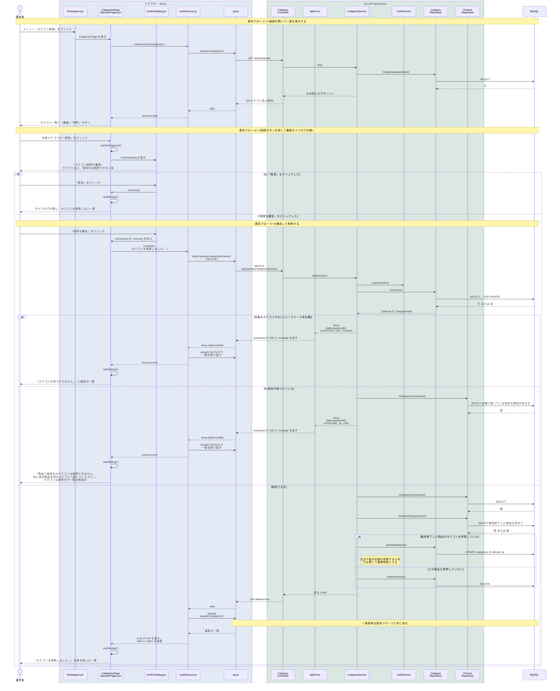

## EC-A09 商品カテゴリを削除する

```mermaid
sequenceDiagram
    actor User as 運営者
    box rgba(47,111,219,0.10) ブラウザー React
        participant Work as Workspace.jsx
        participant Page as CategoriesPage<br/>OperatorPages.jsx
        participant Dlg as ConfirmDialog.jsx
        participant Hook as useResource.js
        participant Http as api.js
    end
    box rgba(27,127,92,0.12) EC API Spring Boot
        participant Ctrl as Category<br/>Controller
        participant Errs as ApiErrors
        participant Svc as CategoryService
        participant Auth as AuthService
        participant Repo as Category<br/>Repository
        participant Prod as Product<br/>Repository
    end
    participant Db as MySQL

    Note over User,Db: 基本フロー 1〜2 画面を開いて一覧を表示する
    User->>Work: メニュー「カテゴリ管理」をクリック
    Work->>Page: CategoriesPage を表示
    Page->>Hook: useResource('/categories')
    Hook->>Http: request('/categories')
    Http->>Ctrl: GET /api/categories
    Ctrl->>Svc: list()
    Svc->>Repo: findByDeletedAtIsNull()
    Repo->>Db: SELECT
    Db-->>Repo: 行
    Svc-->>Ctrl: 名前順の文字列リスト
    Ctrl-->>Http: 200 カテゴリ名の配列
    Http-->>Hook: data
    Hook-->>Page: resource.data
    Page-->>User: カテゴリ一覧と「編集」「削除」ボタン

    Note over User,Db: 基本フロー 3〜4 削除ボタンを押して確認ダイアログを開く
    User->>Page: 対象カテゴリの「削除」をクリック
    Page->>Page: setDeleting(name)
    Page->>Dlg: ConfirmDialog を表示
    Dlg-->>User: 「カテゴリ削除の確認」<br/>カテゴリ名と、使用中は削除できない旨

    alt 5a 「取消」をクリックした
        User->>Dlg: 「取消」をクリック
        Dlg->>Page: onCancel()
        Page->>Page: setDeleting('')
        Page-->>User: ダイアログが閉じ、カテゴリを削除しない一覧
    else 「削除を確定」をクリックした
        Note over User,Db: 基本フロー 5〜6 確定して削除する
        User->>Dlg: 「削除を確定」をクリック
        Dlg->>Page: onConfirm() が remove() を呼ぶ
        Page->>Hook: run(action,<br/>'カテゴリを削除しました。')
        Hook->>Http: write('/operator/categories/{name}',<br/>'DELETE')
        Http->>Ctrl: DELETE<br/>/api/operator/categories/{name}
        Ctrl->>Svc: delete(name)
        Svc->>Auth: requireAdmin()
        Svc->>Repo: lock(name)
        Repo->>Db: SELECT ... FOR UPDATE
        Db-->>Repo: 行 または 空
        Repo-->>Svc: Optional の CategoryEntity
        alt 対象のカテゴリがない (ユースケース未記載)
            Svc--xErrs: throw<br/>ApiException(404,<br/>CATEGORY_NOT_FOUND)
            Errs-->>Http: business() が 404 と message を返す
            Http--xHook: throw ApiError(404)
            Hook->>Http: reload() 404 なので<br/>一覧を取り直す
            Hook-->>Page: resource.error
            Page->>Page: setDeleting('')
            Page-->>User: 「カテゴリが見つかりません。」と最新の一覧
        else 6a 商品が紐づいている
            Svc->>Prod: isCategoryInUse(name)
            Prod->>Db: SELECT 店舗に残っている有効な商品があるか
            Db-->>Prod: 真
            Svc--xErrs: throw<br/>ApiException(409,<br/>CATEGORY_IN_USE)
            Errs-->>Http: business() が 409 と message を返す
            Http--xHook: throw ApiError(409)
            Hook->>Http: reload() 409 なので<br/>一覧を取り直す
            Hook-->>Page: resource.error
            Page->>Page: setDeleting('')
            Page-->>User: 「商品で使用中のカテゴリは削除できません。<br/>先に該当商品を別のカテゴリへ移してください。」<br/>カテゴリは削除せず一覧を再表示
        else 削除できる
            Svc->>Prod: isCategoryInUse(name)
            Prod->>Db: SELECT
            Db-->>Prod: 偽
            Svc->>Prod: existsByCategory(name)
            Prod->>Db: SELECT 販売終了した商品も含めて
            Db-->>Prod: 真 または 偽
            alt 販売終了した商品がカテゴリを参照している
                Svc->>Repo: setDeletedAt(now)
                Repo->>Db: UPDATE categories の deleted_at
                Note right of Svc: 注文や庭の記録が参照するため<br/>行は残して論理削除にする
            else どの商品も参照していない
                Svc->>Repo: delete(category)
                Repo->>Db: DELETE
            end
            Svc-->>Ctrl: 戻る (void)
            Ctrl-->>Http: 200 deleted=true
            Http-->>Hook: data
            Hook->>Http: reload()<br/>request('/categories')
            Note over Http,Db: 一覧取得は基本フロー 2 と同じ流れ
            Http-->>Hook: 最新の一覧
            Hook-->>Page: run() が true を返す。<br/>data と notice を更新
            Page->>Page: setDeleting('')
            Page-->>User: 「カテゴリを削除しました。」、対象を除いた一覧
        end
    end
```
