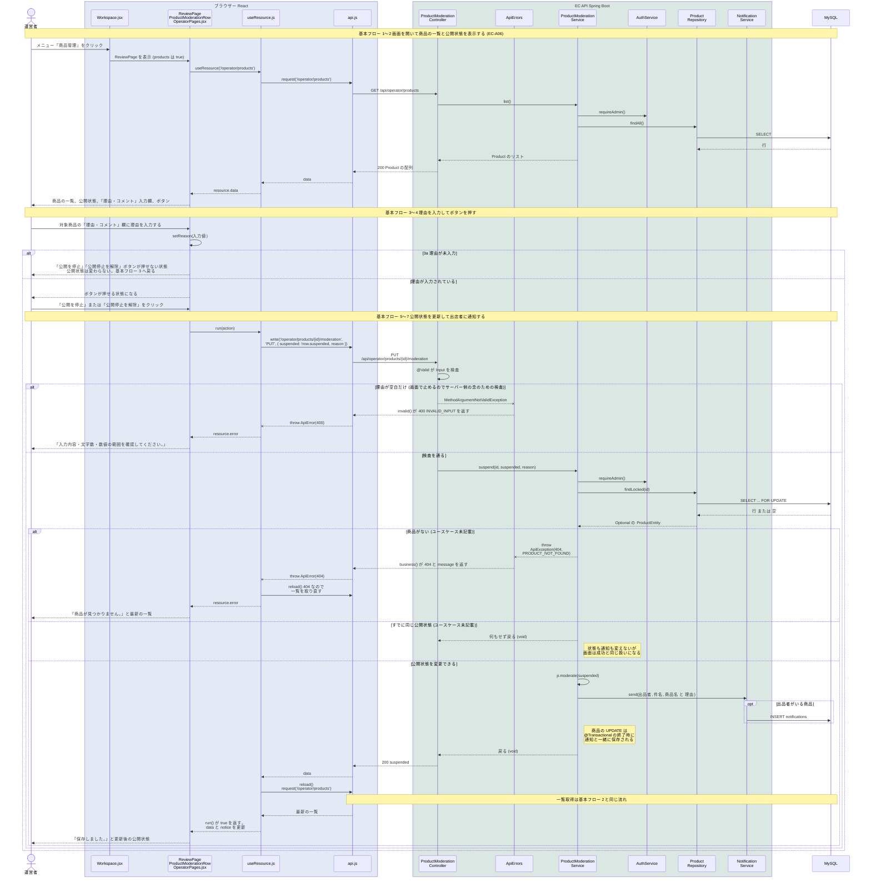

## EC-A10 商品の公開を停止・再開する

```mermaid
sequenceDiagram
    actor User as 運営者
    box rgba(47,111,219,0.10) ブラウザー React
        participant Work as Workspace.jsx
        participant Page as ReviewPage<br/>ProductModerationRow<br/>OperatorPages.jsx
        participant Hook as useResource.js
        participant Http as api.js
    end
    box rgba(27,127,92,0.12) EC API Spring Boot
        participant Ctrl as ProductModeration<br/>Controller
        participant Errs as ApiErrors
        participant Svc as ProductModeration<br/>Service
        participant Auth as AuthService
        participant Repo as Product<br/>Repository
        participant Ntf as Notification<br/>Service
    end
    participant Db as MySQL

    Note over User,Db: 基本フロー 1〜2 画面を開いて商品の一覧と公開状態を表示する (EC-A06)
    User->>Work: メニュー「商品管理」をクリック
    Work->>Page: ReviewPage を表示 (products は true)
    Page->>Hook: useResource('/operator/products')
    Hook->>Http: request('/operator/products')
    Http->>Ctrl: GET /api/operator/products
    Ctrl->>Svc: list()
    Svc->>Auth: requireAdmin()
    Svc->>Repo: findAll()
    Repo->>Db: SELECT
    Db-->>Repo: 行
    Svc-->>Ctrl: Product のリスト
    Ctrl-->>Http: 200 Product の配列
    Http-->>Hook: data
    Hook-->>Page: resource.data
    Page-->>User: 商品の一覧、公開状態、「理由・コメント」入力欄、ボタン

    Note over User,Db: 基本フロー 3〜4 理由を入力してボタンを押す
    User->>Page: 対象商品の「理由・コメント」欄に理由を入力する
    Page->>Page: setReason(入力値)
    alt 3a 理由が未入力
        Page-->>User: 「公開を停止」「公開停止を解除」ボタンが押せない状態<br/>公開状態は変わらない。基本フロー 3 へ戻る
    else 理由が入力されている
        Page-->>User: ボタンが押せる状態になる
        User->>Page: 「公開を停止」または「公開停止を解除」をクリック
        Note over User,Db: 基本フロー 5〜7 公開状態を更新して出店者に通知する
        Page->>Hook: run(action)
        Hook->>Http: write('/operator/products/{id}/moderation',<br/>'PUT', { suspended: !row.suspended, reason })
        Http->>Ctrl: PUT<br/>/api/operator/products/{id}/moderation
        Ctrl->>Ctrl: @Valid が Input を検査
        alt 理由が空白だけ (画面で止めるのでサーバー側の念のための検査)
            Ctrl--xErrs: MethodArgumentNotValidException
            Errs-->>Http: invalid() が 400 INVALID_INPUT を返す
            Http--xHook: throw ApiError(400)
            Hook-->>Page: resource.error
            Page-->>User: 「入力内容・文字数・数値の範囲を確認してください。」
        else 検査を通る
            Ctrl->>Svc: suspend(id, suspended, reason)
            Svc->>Auth: requireAdmin()
            Svc->>Repo: findLocked(id)
            Repo->>Db: SELECT ... FOR UPDATE
            Db-->>Repo: 行 または 空
            Repo-->>Svc: Optional の ProductEntity
            alt 商品がない (ユースケース未記載)
                Svc--xErrs: throw<br/>ApiException(404,<br/>PRODUCT_NOT_FOUND)
                Errs-->>Http: business() が 404 と message を返す
                Http--xHook: throw ApiError(404)
                Hook->>Http: reload() 404 なので<br/>一覧を取り直す
                Hook-->>Page: resource.error
                Page-->>User: 「商品が見つかりません。」と最新の一覧
            else すでに同じ公開状態 (ユースケース未記載)
                Svc-->>Ctrl: 何もせず戻る (void)
                Note right of Svc: 状態も通知も変えないが<br/>画面は成功と同じ扱いになる
            else 公開状態を変更できる
                Svc->>Svc: p.moderate(suspended)
                Svc->>Ntf: send(出品者, 件名, 商品名 と 理由)
                opt 出品者がいる商品
                    Ntf->>Db: INSERT notifications
                end
                Note right of Svc: 商品の UPDATE は<br/>@Transactional の終了時に<br/>通知と一緒に保存される
                Svc-->>Ctrl: 戻る (void)
                Ctrl-->>Http: 200 suspended
                Http-->>Hook: data
                Hook->>Http: reload()<br/>request('/operator/products')
                Note over Http,Db: 一覧取得は基本フロー 2 と同じ流れ
                Http-->>Hook: 最新の一覧
                Hook-->>Page: run() が true を返す。<br/>data と notice を更新
                Page-->>User: 「保存しました。」と更新後の公開状態
            end
        end
    end
```
