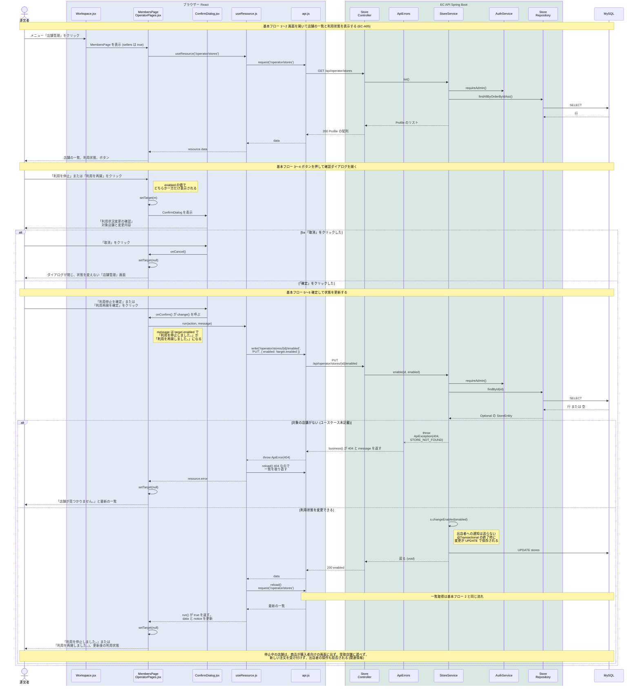

## EC-A11 店舗の利用を停止・再開する

```mermaid
sequenceDiagram
    actor User as 運営者
    box rgba(47,111,219,0.10) ブラウザー React
        participant Work as Workspace.jsx
        participant Page as MembersPage<br/>OperatorPages.jsx
        participant Dlg as ConfirmDialog.jsx
        participant Hook as useResource.js
        participant Http as api.js
    end
    box rgba(27,127,92,0.12) EC API Spring Boot
        participant Ctrl as Store<br/>Controller
        participant Errs as ApiErrors
        participant Svc as StoreService
        participant Auth as AuthService
        participant Repo as Store<br/>Repository
    end
    participant Db as MySQL

    Note over User,Db: 基本フロー 1〜2 画面を開いて店舗の一覧と利用状態を表示する (EC-A05)
    User->>Work: メニュー「店舗管理」をクリック
    Work->>Page: MembersPage を表示 (sellers は true)
    Page->>Hook: useResource('/operator/stores')
    Hook->>Http: request('/operator/stores')
    Http->>Ctrl: GET /api/operator/stores
    Ctrl->>Svc: list()
    Svc->>Auth: requireAdmin()
    Svc->>Repo: findAllByOrderByIdAsc()
    Repo->>Db: SELECT
    Db-->>Repo: 行
    Svc-->>Ctrl: Profile のリスト
    Ctrl-->>Http: 200 Profile の配列
    Http-->>Hook: data
    Hook-->>Page: resource.data
    Page-->>User: 店舗の一覧、利用状態、ボタン

    Note over User,Db: 基本フロー 3〜4 ボタンを押して確認ダイアログを開く
    User->>Page: 「利用を停止」または「利用を再開」をクリック
    Note right of Page: enabled の値で<br/>どちらか一方だけ表示される
    Page->>Page: setTarget(m)
    Page->>Dlg: ConfirmDialog を表示
    Dlg-->>User: 「利用状況変更の確認」<br/>対象店舗と変更内容

    alt 5a 「取消」をクリックした
        User->>Dlg: 「取消」をクリック
        Dlg->>Page: onCancel()
        Page->>Page: setTarget(null)
        Page-->>User: ダイアログが閉じ、状態を変えない「店舗管理」画面
    else 「確定」をクリックした
        Note over User,Db: 基本フロー 5〜6 確定して状態を更新する
        User->>Dlg: 「利用停止を確定」または<br/>「利用再開を確定」をクリック
        Dlg->>Page: onConfirm() が change() を呼ぶ
        Page->>Hook: run(action, message)
        Note right of Page: message は target.enabled で<br/>「利用を停止しました。」か<br/>「利用を再開しました。」になる
        Hook->>Http: write('/operator/stores/{id}/enabled',<br/>'PUT', { enabled: !target.enabled })
        Http->>Ctrl: PUT<br/>/api/operator/stores/{id}/enabled
        Ctrl->>Svc: enable(id, enabled)
        Svc->>Auth: requireAdmin()
        Svc->>Repo: findById(id)
        Repo->>Db: SELECT
        Db-->>Repo: 行 または 空
        Repo-->>Svc: Optional の StoreEntity
        alt 対象の店舗がない (ユースケース未記載)
            Svc--xErrs: throw<br/>ApiException(404,<br/>STORE_NOT_FOUND)
            Errs-->>Http: business() が 404 と message を返す
            Http--xHook: throw ApiError(404)
            Hook->>Http: reload() 404 なので<br/>一覧を取り直す
            Hook-->>Page: resource.error
            Page->>Page: setTarget(null)
            Page-->>User: 「店舗が見つかりません。」と最新の一覧
        else 利用状態を変更できる
            Svc->>Svc: s.changeEnabled(enabled)
            Note right of Svc: 出店者への通知は送らない<br/>@Transactional の終了時に<br/>変更が UPDATE で保存される
            Svc->>Db: UPDATE stores
            Svc-->>Ctrl: 戻る (void)
            Ctrl-->>Http: 200 enabled
            Http-->>Hook: data
            Hook->>Http: reload()<br/>request('/operator/stores')
            Note over Http,Db: 一覧取得は基本フロー 2 と同じ流れ
            Http-->>Hook: 最新の一覧
            Hook-->>Page: run() が true を返す。<br/>data と notice を更新
            Page->>Page: setTarget(null)
            Page-->>User: 「利用を停止しました。」または<br/>「利用を再開しました。」、更新後の利用状態
            Note over User,Db: 停止中の店舗は、商品が購入者向けの画面に出ず、受取店舗に選べず、<br/>新しい注文を受け付けず、出店者の操作も拒否される (関連情報)
        end
    end
```