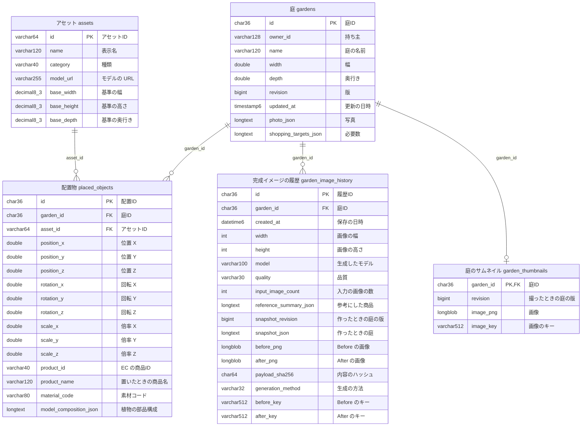

# テーブル設計書

## Kusakari Canvas

```mermaid
erDiagram
    assets ||--o{ placed_objects : "asset_id"
    gardens ||--o{ placed_objects : "garden_id"
    gardens ||--o{ garden_image_history : "garden_id"
    gardens ||--o| garden_thumbnails : "garden_id"
    gardens["庭 gardens"] {
        char36 id PK "庭ID"
        varchar128 owner_id "持ち主"
        varchar120 name "庭の名前"
        double width "幅"
        double depth "奥行き"
        bigint revision "版"
        timestamp6 updated_at "更新の日時"
        longtext photo_json "写真"
        longtext shopping_targets_json "必要数"
    }
    placed_objects["配置物 placed_objects"] {
        char36 id PK "配置ID"
        char36 garden_id FK "庭ID"
        varchar64 asset_id FK "アセットID"
        double position_x "位置 X"
        double position_y "位置 Y"
        double position_z "位置 Z"
        double rotation_x "回転 X"
        double rotation_y "回転 Y"
        double rotation_z "回転 Z"
        double scale_x "倍率 X"
        double scale_y "倍率 Y"
        double scale_z "倍率 Z"
        varchar40 product_id "EC の商品ID"
        varchar120 product_name "置いたときの商品名"
        varchar80 material_code "素材コード"
        longtext model_composition_json "植物の部品構成"
    }
    assets["アセット assets"] {
        varchar64 id PK "アセットID"
        varchar120 name "表示名"
        varchar40 category "種類"
        varchar255 model_url "モデルの URL"
        decimal8_3 base_width "基準の幅"
        decimal8_3 base_height "基準の高さ"
        decimal8_3 base_depth "基準の奥行き"
    }
    garden_image_history["完成イメージの履歴 garden_image_history"] {
        char36 id PK "履歴ID"
        char36 garden_id FK "庭ID"
        datetime6 created_at "保存の日時"
        int width "画像の幅"
        int height "画像の高さ"
        varchar100 model "生成したモデル"
        varchar30 quality "品質"
        int input_image_count "入力の画像の数"
        longtext reference_summary_json "参考にした商品"
        bigint snapshot_revision "作ったときの庭の版"
        longtext snapshot_json "作ったときの庭"
        longblob before_png "Before の画像"
        longblob after_png "After の画像"
        char64 payload_sha256 "内容のハッシュ"
        varchar32 generation_method "生成の方法"
        varchar512 before_key "Before のキー"
        varchar512 after_key "After のキー"
    }
    garden_thumbnails["庭のサムネイル garden_thumbnails"] {
        char36 garden_id PK, FK "庭ID"
        bigint revision "撮ったときの庭の版"
        longblob image_png "画像"
        varchar512 image_key "画像のキー"
    }
```

## Kusakari EC

```mermaid
erDiagram
    members ||--o| member_pickup_contacts : "member_id"
    members ||--o{ notifications : "member_id"
    stores |o--o{ notifications : "store_id"
    members ||--o{ organization_applications : "applicant_member_id"
    organizations |o--o| organization_applications : "organization_id"
    members |o--o{ organizations : "owner_member_id, owner_account_type"
    members |o--o{ organizations : "pending_owner_member_id"
    members ||--o{ organization_members : "member_id, member_account_type"
    organizations ||--o{ organization_members : "organization_id"
    organizations ||--o{ stores : "organization_id"
    organization_members ||--o{ store_members : "organization_id, member_id"
    stores ||--o{ store_members : "store_id, organization_id"
    members ||--o{ store_invitations : "issued_by_member_id"
    stores ||--o{ store_invitations : "store_id"
    store_invitations ||--o{ store_invitation_uses : "invitation_id"
    members ||--o| store_invitation_uses : "member_id"
    categories ||--o{ products : "category_name"
    members |o--o{ products : "created_by_member_id"
    stores ||--o{ products : "store_id"
    products ||--o{ product_images : "product_id"
    products ||--o| inventory : "product_id"
    products ||--o{ material_products : "product_id"
    members ||--o| carts : "member_id"
    carts ||--o{ cart_items : "cart_id"
    products ||--o{ cart_items : "product_id"
    carts ||--o{ garden_shopping_lists : "cart_id"
    garden_shopping_lists ||--o{ garden_shopping_items : "cart_id, garden_id"
    products ||--o{ garden_shopping_items : "product_id"
    members ||--o{ orders : "buyer_member_id"
    members |o--o{ orders : "cancelled_by_member_id"
    carts ||--o{ orders : "cart_id"
    payments |o--o{ orders : "payment_id, cart_id, request_id"
    stores ||--o{ orders : "store_id"
    orders ||--o{ order_items : "order_id"
    members ||--o{ payments : "buyer_member_id"
    carts ||--o{ payments : "cart_id"
    orders ||--o{ refunds : "order_id, payment_id"
    payments ||--o{ refunds : "payment_id"
    members |o--o{ refunds : "requested_by_member_id"
    members ||--o{ product_moderation_events : "actor_member_id"
    products ||--o{ product_moderation_events : "product_id"
    members ||--o{ store_moderation_events : "actor_member_id"
    stores ||--o{ store_moderation_events : "store_id"
    members |o--o{ organization_moderation_events : "actor_member_id"
    organizations ||--o{ organization_moderation_events : "organization_id"
    members ||--o{ organization_member_events : "actor_member_id"
    organizations ||--o{ organization_member_events : "organization_id"
    stores |o--o{ organization_member_events : "store_id, organization_id"
    members ||--o{ organization_member_events : "target_member_id"
    members["会員 <br>members"] {
        char36 id PK, UK "会員ID"
        varchar255 issuer UK "認証の発行元"
        varchar255 subject UK "認証の利用者ID"
        varchar255 email "メールアドレス"
        varchar120 display_name "表示名"
        varchar32 account_type UK "会員の種別"
        boolean enabled "有効"
        timestamp6 email_verified_at "メール確認の日時"
        timestamp6 withdrawn_at "退会の日時"
        timestamp6 created_at "登録の日時"
    }
    member_pickup_contacts["受取連絡先<br> member_pickup_contacts"] {
        char36 member_id PK, FK "会員ID"
        varchar120 recipient_name "受取人の名前"
        varchar40 recipient_phone "受取人の電話番号"
        varchar255 contact_email "連絡用のメールアドレス"
    }
    notifications["通知 <br>notifications"] {
        char36 id PK "通知ID"
        char36 member_id FK "あて先の会員"
        varchar16 kind "通知の種類"
        bigint store_id FK "あて先の店舗"
        varchar32 category "通知の分類"
        varchar200 title "題名"
        varchar2000 body "本文"
        timestamp6 created_at "作成の日時"
        timestamp6 read_at "既読の日時"
    }
    organization_applications["事業者申請 <br>organization_applications"] {
        char36 id PK "申請ID"
        char36 applicant_member_id FK, UK "申請した会員"
        varchar20 status "申請の状態"
        boolean is_latest UK "今の申請か"
        varchar160 organization_name "事業者名"
        varchar120 contact_name "担当者名"
        varchar255 contact_email "連絡用のメールアドレス"
        varchar40 contact_phone "電話番号"
        varchar255 company_address "会社の住所"
        varchar1000 rejection_reason "却下の理由"
        varchar255 document_name "確認書類のファイル名"
        varchar100 document_type "確認書類の形式"
        longblob document_data "確認書類の中身"
        bigint organization_id FK, UK "作った組織"
        timestamp6 created_at "作成の日時"
        timestamp6 submitted_at "提出の日時"
        timestamp6 reviewed_at "審査の日時"
    }
    organizations["組織<br> organizations"] {
        bigint id PK "組織ID"
        varchar160 name "事業者名"
        char36 owner_member_id FK, UK "オーナー"
        varchar32 owner_account_type FK "オーナーの種別"
        char36 pending_owner_member_id FK "承認待ちの譲り先"
        timestamp6 pending_owner_expires_at "引き継ぎの承認期限"
        timestamp6 suspension_started_at "受付停止の開始日時"
        boolean suspended "停止中"
        timestamp6 created_at "作成の日時"
    }
    organization_members["組織の所属<br> organization_members"] {
        bigint organization_id PK, FK "組織ID"
        char36 member_id PK, FK, UK "会員ID"
        varchar32 member_account_type FK "会員の種別"
        varchar16 role "組織のロール"
        boolean expelled "除名済み"
        timestamp6 created_at "所属の日時"
    }
    stores["店舗<br>stores"] {
        bigint id PK, UK "店舗ID"
        bigint organization_id FK, UK "組織ID"
        varchar120 name UK "店舗名"
        varchar255 address "住所"
        double latitude "緯度"
        double longitude "経度"
        varchar255 business_hours "営業時間"
        varchar120 contact_name "担当者名"
        varchar255 contact_email "連絡用のメールアドレス"
        varchar2000 introduction "紹介文"
        boolean published "公開中"
        boolean suspended "停止中"
        timestamp6 closing_started_at "閉鎖の開始日時"
        varchar16 closing_started_by "閉鎖を始めた人"
        timestamp6 closed_at "閉鎖済みの日時"
        bigint revision "版"
        timestamp6 created_at "作成の日時"
    }
    store_members["店舗の担当<br> store_members"] {
        bigint store_id PK, FK "店舗ID"
        char36 member_id PK, FK "会員ID"
        bigint organization_id FK "組織ID"
        varchar16 role "店舗のロール"
        timestamp6 created_at "担当になった日時"
    }
    store_invitations["招待キー<br>store_invitations"] {
        char36 id PK "招待キーID"
        bigint store_id FK "招待する店舗"
        char36 issued_by_member_id FK "発行した会員"
        char64 key_hash UK "キーのハッシュ"
        timestamp6 expires_at "有効期限"
        int max_uses "使える回数"
        timestamp6 revoked_at "取り消しの日時"
        timestamp6 created_at "発行の日時"
    }
    store_invitation_uses["招待キーの使用<br>store_invitation_uses"] {
        char36 invitation_id PK, FK "招待キーID"
        char36 member_id PK, FK, UK "登録した会員"
        timestamp6 used_at "使った日時"
    }
    categories["カテゴリー<br> categories"] {
        varchar80 name PK "カテゴリー名"
        timestamp6 deleted_at "削除の日時"
    }
    products["商品 <br>products"] {
        varchar40 id PK "商品ID"
        bigint store_id FK, UK "売る店舗"
        char36 created_by_member_id FK "追加した会員"
        varchar64 sku UK "商品番号"
        varchar120 name "商品名"
        varchar120 latin_name "学名"
        varchar80 category_name FK "カテゴリー名"
        text description "商品説明"
        varchar80 size_label "サイズの表示"
        text care "育て方"
        int price_yen "税込価格"
        varchar20 unit "単位"
        varchar250 image_url "代表画像の URL"
        varchar30 badge "バッジの文字"
        varchar30 source "登録元"
        varchar120 source_product_id "登録元の商品ID"
        timestamp6 source_updated_at "登録元の更新日時"
        varchar100 nursery_name "生産者名"
        varchar200 nursery_address "生産者の住所"
        varchar30 sunlight "日当たり"
        varchar80 use_case "用途・植える場所"
        int care_level "手入れのレベル"
        int min_temperature_c "最低気温"
        boolean heat_tolerant "暑さに強い"
        boolean drought_tolerant "乾燥に強い"
        int age_years "樹齢の目安"
        int height_cm "高さ"
        int pot_diameter_cm "鉢の直径"
        varchar100 family_name "科名・属名"
        text flowering_description "開花の説明"
        text seasonal_care "季節の手入れ"
        text style_description "庭のスタイルの説明"
        json plant_model_profile "植物モデルの特徴"
        json model_composition "植物モデルの部品構成"
        boolean suspended "停止中"
        timestamp6 published_at "掲載の日時"
    }
    product_images["商品画像<br> product_images"] {
        varchar40 product_id PK, FK "商品ID"
        int sort_order PK "並び順"
        varchar2048 image_url "画像の URL"
    }
    product_media["画像データ<br> product_media"] {
        varchar36 id PK "画像ID"
        varchar30 content_type "画像の形式"
        longblob image_data "画像の中身"
    }
    inventory["在庫 <br>inventory"] {
        varchar40 product_id PK, FK "商品ID"
        int quantity "在庫数"
        varchar16 publication_status "公開の状態"
    }
    material_products["素材コードの対応<br> material_products"] {
        varchar80 material_code PK "素材コード"
        varchar40 product_id PK, FK "商品ID"
    }
    carts["カート<br> carts"] {
        char36 id PK "カートID"
        char36 member_id FK, UK "会員ID"
        bigint revision "版"
        timestamp6 created_at "作成の日時"
    }
    cart_items["カートの商品<br> cart_items"] {
        char36 cart_id PK, FK "カートID"
        varchar40 product_id PK, FK "商品ID"
        int quantity "数量"
    }
    garden_shopping_lists["庭の買い物リスト<br> garden_shopping_lists"] {
        char36 cart_id PK, FK "カートID"
        char36 garden_id PK "庭ID"
        bigint revision "庭の版"
    }
    garden_shopping_items["庭の買い物リストの商品<br>garden_shopping_items"] {
        char36 cart_id PK, FK "カートID"
        char36 garden_id PK, FK "庭ID"
        varchar40 product_id PK, FK "商品ID"
    }
    orders["注文<br> orders"] {
        char36 id PK, UK "注文ID"
        char36 cart_id FK, UK "お会計したカート"
        char36 request_id FK, UK "お会計のキー"
        bigint request_revision "お会計時のカートの版"
        char36 payment_id FK, UK "決済ID"
        char36 buyer_member_id FK "購入者"
        bigint store_id FK, UK "受取店舗"
        varchar120 store_name "注文時の店舗名"
        varchar255 store_address "注文時の店舗の住所"
        varchar255 store_business_hours "注文時の営業時間"
        varchar30 status "注文の状態"
        int total_yen "合計"
        int commission_rate_bp "手数料の率"
        int commission_yen "手数料の額"
        varchar32 payment_method "支払い方法"
        varchar120 recipient_name "受取人の名前"
        varchar40 recipient_phone "受取人の電話番号"
        varchar255 contact_email "連絡用のメールアドレス"
        varchar24 cancellation_status "キャンセルの状態"
        varchar1000 cancellation_reason "キャンセルの理由"
        varchar1000 cancellation_response "キャンセルへの回答"
        timestamp6 cancellation_at "キャンセルの日時"
        char36 cancelled_by_member_id FK "キャンセルした会員"
        timestamp6 created_at "注文の日時"
        timestamp6 ready_at "受取準備の完了日時"
        timestamp6 picked_up_at "引き渡しの日時"
        timestamp6 deleted_at "履歴から消した日時"
    }
    order_items["注文明細<br>order_items"] {
        char36 order_id PK, FK "注文ID"
        varchar40 product_id PK "商品ID"
        varchar64 sku "注文時の商品番号"
        varchar120 product_name "注文時の商品名"
        int quantity "数量"
        int unit_price_yen "注文時の単価"
    }
    payments["決済<br> payments"] {
        char36 id PK, UK "決済ID"
        char36 cart_id FK, UK "お会計したカート"
        char36 request_id UK "お会計のキー"
        char36 buyer_member_id FK "支払う会員"
        varchar255 payment_intent_id UK "Stripe の PaymentIntent"
        varchar16 status "決済の状態"
        int amount_yen "金額"
        timestamp6 created_at "作成の日時"
        timestamp6 updated_at "更新の日時"
    }
    refunds["返金<br>refunds"] {
        char36 id PK "返金ID"
        char36 order_id FK, UK "返金する注文"
        char36 payment_id FK "返金元の決済"
        varchar255 stripe_refund_id UK "Stripe の Refund"
        varchar16 status "返金の状態"
        int amount_yen "返金の額"
        char36 requested_by_member_id FK "返金を始めた会員"
        timestamp6 created_at "作成の日時"
        timestamp6 updated_at "更新の日時"
    }
    stripe_events["Stripe の通知の記録<br>stripe_events"] {
        varchar255 event_id PK "通知ID"
        varchar100 event_type "通知の種類"
        timestamp6 processed_at "処理の日時"
    }
    product_moderation_events["商品の運営記録<br>product_moderation_events"] {
        bigint id PK "記録ID"
        varchar40 product_id FK "対象の商品"
        varchar16 event_type "操作の種類"
        varchar1000 reason "理由"
        char36 actor_member_id FK "操作した運営者"
        timestamp6 created_at "操作の日時"
    }
    store_moderation_events["店舗の運営記録<br> store_moderation_events"] {
        bigint id PK "記録ID"
        bigint store_id FK "対象の店舗"
        varchar16 event_type "操作の種類"
        varchar1000 reason "理由"
        char36 actor_member_id FK "操作した運営者"
        timestamp6 created_at "操作の日時"
    }
    organization_moderation_events["組織の運営記録<br> organization_moderation_events"] {
        bigint id PK "記録ID"
        bigint organization_id FK "対象の組織"
        varchar16 event_type "操作の種類"
        varchar1000 reason "理由"
        char36 actor_member_id FK "操作した運営者"
        timestamp6 created_at "操作の日時"
    }
    organization_member_events["組織の人の操作記録 <br>organization_member_events"] {
        bigint id PK "記録ID"
        bigint organization_id FK "組織ID"
        varchar40 event_type "操作の種類"
        char36 actor_member_id FK "操作した会員"
        char36 target_member_id FK "操作された会員"
        bigint store_id FK "店舗ID"
        timestamp6 created_at "記録の日時"
    }
```

